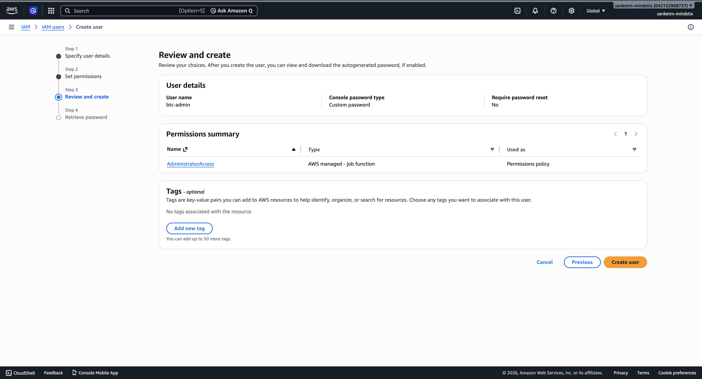
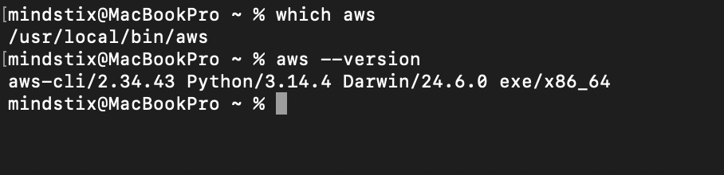
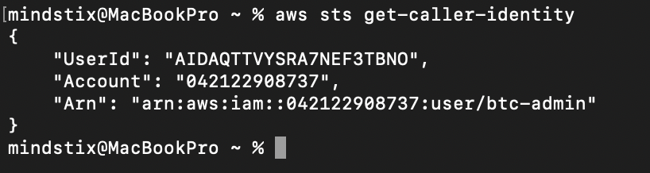
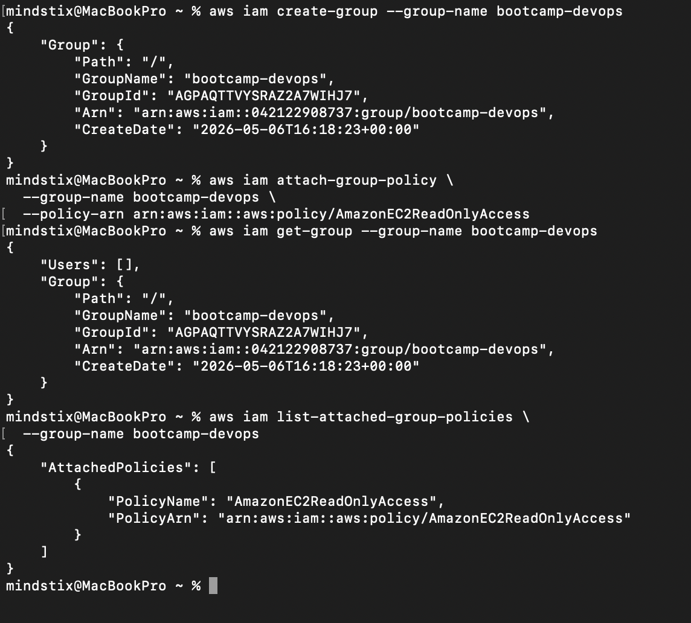
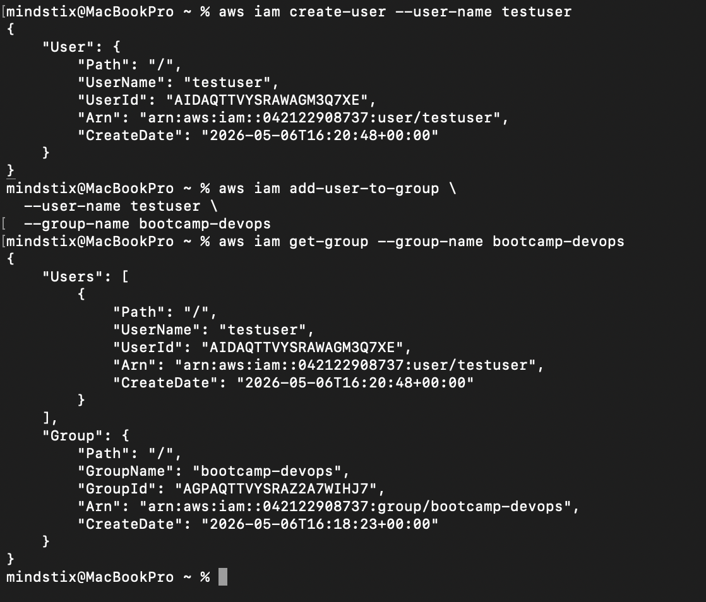
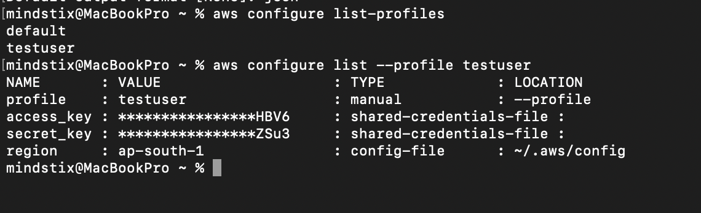
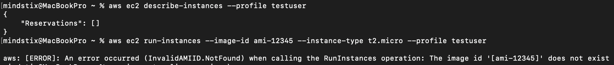
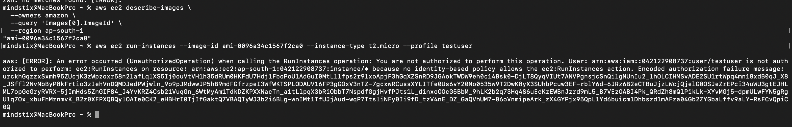

### 1. Enable MFA on your root account. Stop using root after this step.
### 2. Create an IAM user for yourself with programmatic access. Attach AdministratorAccess for now.
IAM User Created - btc-admin



### 3. Install the AWS CLI. Configure it: aws configure


### 4. Run aws sts get-caller-identity. What do the three fields (UserId, Account, Arn) tell you?
**UserID** 
Unique internal identifier of the identity 
For IAM user → looks like AIDA...
For assumed role → includes session info (e.g. AROAXXX:session-name)

**Account**
Account Number. Which account you are operating in.

**ARN**
ARN or the IAM User or the Assumed Role



### 4, Create an IAM group called bootcamp-devops. Attach the AmazonEC2ReadOnlyAccess managed policy.
1. Create IAM Group bootcamp-devops
```bash
aws iam create-group --group-name bootcamp-devops
```

2. Attach the AmazonEC2ReadOnlyAccess managed policy
```bash
aws iam attach-group-policy \
  --group-name bootcamp-devops \
  --policy-arn arn:aws:iam::aws:policy/AmazonEC2ReadOnlyAccess
```




### 5. Create a second IAM user (no console access, no direct permissions). Add them to bootcamp-devops.
1. Create IAM User
```bash
aws iam create-user --user-name testuser
```

2. Add the user to the bootcamp-devops group
```bash
aws iam add-user-to-group \
  --user-name testuser \
  --group-name bootcamp-devops
```




### Configure a second CLI profile for this user: aws configure --profile testuser
```bash
aws iam create-access-key --user-name testuser
```

```bash
aws configure --profile testuser
```

```bash
aws configure list --profile testuser
```




### Run aws ec2 describe-instances --profile testuser — does it work?
It works.


### Run aws ec2 run-instances --image-id ami-12345 --instance-type t2.micro --profile testuser — what happens? What specific error do you get?
Error - aws: [ERROR]: An error occurred (InvalidAMIID.NotFound) when calling the RunInstances operation: The image id '[ami-12345]' does not exist

We are getting this error because the ami id is not valid

After trying the same command with the valid ami-id
We are getting the following error -


We are getting this error because of the policy assigned to the user

The policy is as below -
```bash
aws iam get-policy-version \                                                          
  --policy-arn arn:aws:iam::aws:policy/AmazonEC2ReadOnlyAccess \
  --version-id v1
```

```bash
{
    "PolicyVersion": {
        "Document": {
            "Version": "2012-10-17",
            "Statement": [
                {
                    "Effect": "Allow",
                    "Action": "ec2:Describe*",
                    "Resource": "*"
                },
                {
                    "Effect": "Allow",
                    "Action": "elasticloadbalancing:Describe*",
                    "Resource": "*"
                },
                {
                    "Effect": "Allow",
                    "Action": [
                        "cloudwatch:ListMetrics",
                        "cloudwatch:GetMetricStatistics",
                        "cloudwatch:Describe*"
                    ],
                    "Resource": "*"
                },
                {
                    "Effect": "Allow",
                    "Action": "autoscaling:Describe*",
                    "Resource": "*"
                }
            ]
        },
        "VersionId": "v1",
        "IsDefaultVersion": false,
        "CreateDate": "2015-02-06T18:40:17+00:00"
    }
}
```

This policy explicitly allows ec2:Describe command. Other all the operations which are not explicitly allowed will be implicitly denied.


### What is the difference between a managed policy and an inline policy?
1. AWS Managed policy
These are the policies maintained by AWS itself. They cannot be modified

2. Customer Managed policy
Policy you create for specific use cases, and you can change or update them as often as you like.

3. Inline Policies
Policy created for a single IAM identity (user, group, or role) that maintains a strict one-to-one relationship between a policy and an identity.
