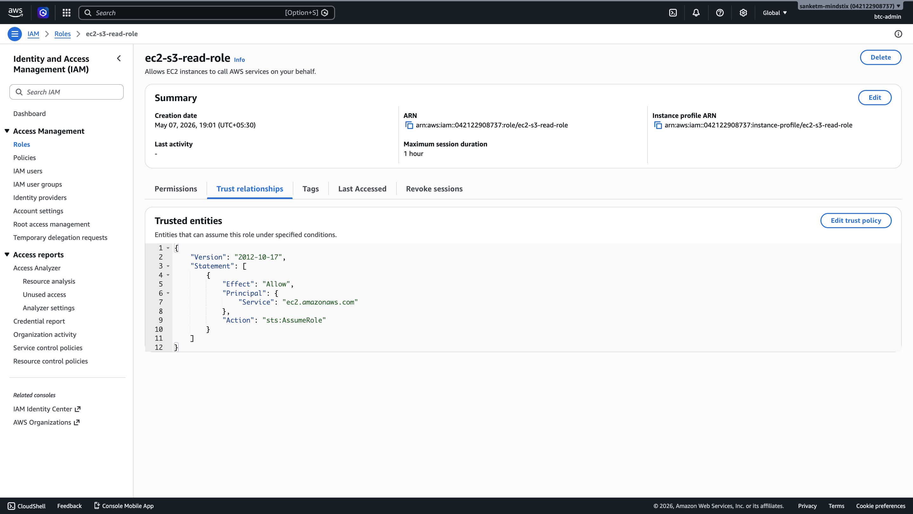
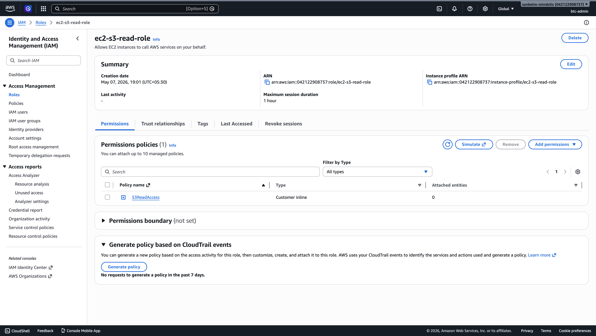
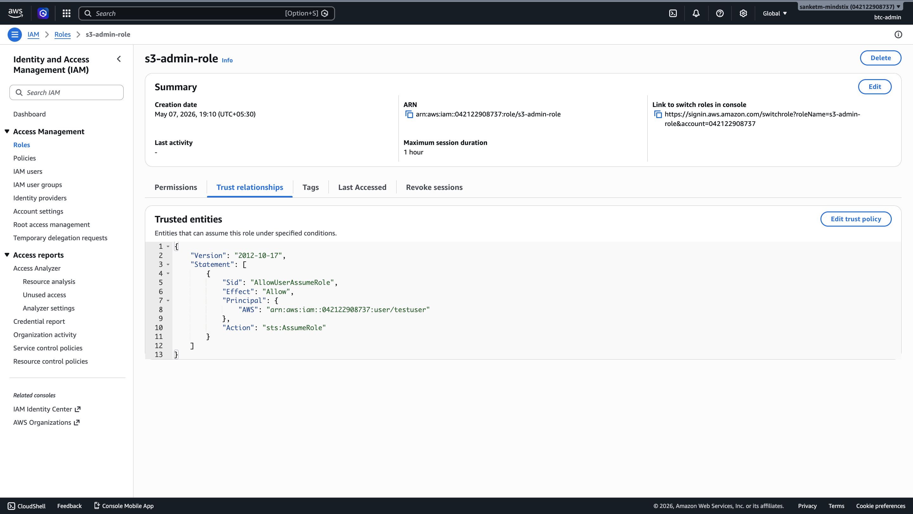
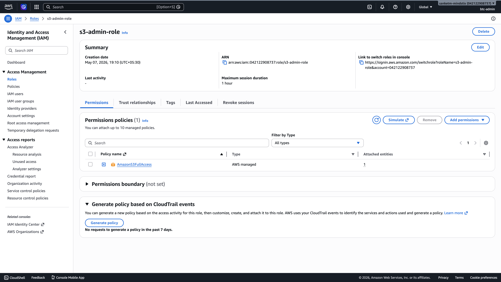
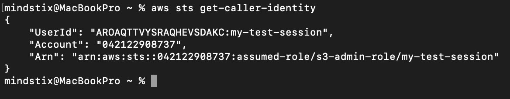

## Assignment 1B — Roles and Trust Policies
Role creation docs: https://docs.aws.amazon.com/IAM/latest/UserGuide/id_roles_create.html Assume role docs: https://docs.aws.amazon.com/IAM/latest/UserGuide/id_roles_use.html

### 1. Create an IAM role ec2-s3-read-role:
#### Trust policy: allows the EC2 service (ec2.amazonaws.com) to assume this role
#### Permissions policy: s3:GetObject and s3:ListBucket on all resources (you'll tighten this later)
Permission Policy 
```bash
{
    "Version": "2012-10-17",
    "Statement": [
        {
            "Sid": "VisualEditor0",
            "Effect": "Allow",
            "Action": [
                "s3:GetObject",
                "s3:ListBucket"
            ],
            "Resource": "*"
        }
    ]
}
```



### 2. Read the trust policy JSON carefully. Answer in your log: why does the trust policy exist separately from the permissions policy? 
The trust policy controls who is allowed to assume the role. It defines the trusted entities, such as EC2 or Lambda services.

The permissions policy controls what actions the role can perform after it is assumed, such as reading objects from S3.

AWS separates these policies to provide better security and flexibility:

Trust policy = “Who can use the role”
Permissions policy = “What the role can do”

### 3. What would happen if you changed the trust policy to allow lambda.amazonaws.com instead of ec2.amazonaws.com? Would an EC2 instance be able to use the role?
Then only the lamda can use this role

### 4. Create a second role s3-admin-role:
#### Trust policy: allows your IAM user ARN to assume it (not a service — you personally)
#### Permissions policy: AmazonS3FullAccess

Trust Policy
```bash
{
	"Version": "2012-10-17",
	"Statement": [
		{
			"Sid": "AllowsUserAssumeRole",
			"Effect": "Allow",
			"Principal": {
				"AWS": "arn:aws:iam::042122908737:user/testuser"
			},
			"Action": "sts:AssumeRole"
		}
	]
}
```



### 5. Assume this role via CLI:
aws sts assume-role \
  --role-arn arn:aws:iam::<account-id>:role/s3-admin-role \
  --role-session-name my-test-session
The output gives temporary AccessKeyId, SecretAccessKey, and SessionToken. Export them as environment variables and run aws sts get-caller-identity. What does the Arn field show now?



The ARN Field shows the AssumedRole ARN instead of the User ARN

### 6. Question for your log: You assumed a role with AmazonS3FullAccess. Can you now do EC2 operations with those temporary credentials? Why or why not?
Ans -> NO, user cannot perform EC2 operations because the role does not allow the EC2 operations.
