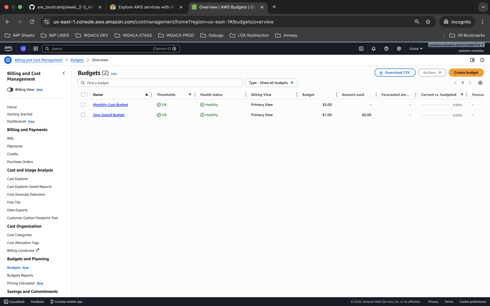

###  Billing Alert — Do This First
Docs: https://docs.aws.amazon.com/cost-management/latest/userguide/budgets-create.html

Set up budget alerts before launching any resource.

Go to Billing and Cost Management → Budgets → Create budget.
Create a Zero spend budget — alerts you the moment any charge appears at all.
Create a second budget at $5/month as a safety net.
Add your email as the alert recipient on both.

