## Assignment 2A

### 1. Build this architecture using CLI commands only. The console is for verification only.
```bash
VPC CIDR: 10.0.0.0/16

Public Subnet A:  10.0.1.0/24  (use your region's first AZ)
Public Subnet B:  10.0.2.0/24  (use your region's second AZ)
Private Subnet A: 10.0.3.0/24  (same AZ as Public Subnet A)
Private Subnet B: 10.0.4.0/24  (same AZ as Public Subnet B)

Internet Gateway: created and attached to the VPC
Public Route Table: 0.0.0.0/0 → IGW, associated with both public subnets
Private Route Table: local route only, associated with both private subnets
Commands you'll need — find the exact syntax in the CLI reference:

aws ec2 create-vpc --cidr-block ...
aws ec2 create-subnet ...
aws ec2 create-internet-gateway
aws ec2 attach-internet-gateway ...
aws ec2 create-route-table ...
aws ec2 create-route ...
aws ec2 associate-route-table ...
Verify: aws ec2 describe-route-tables --filters "Name=vpc-id,Values=<vpc-id>"
```

### 1. Find all availability zones
```bash
aws ec2 describe-availability-zones
```

Store the REGION and Availability Zones in the Variables
```bash
AZ1=$(aws ec2 describe-availability-zones \
--region $REGION \
--query 'AvailabilityZones[0].ZoneName' \
--output text)

AZ2=$(aws ec2 describe-availability-zones \
--region $REGION \
--query 'AvailabilityZones[1].ZoneName' \
--output text)

echo $AZ1
echo $AZ2
```

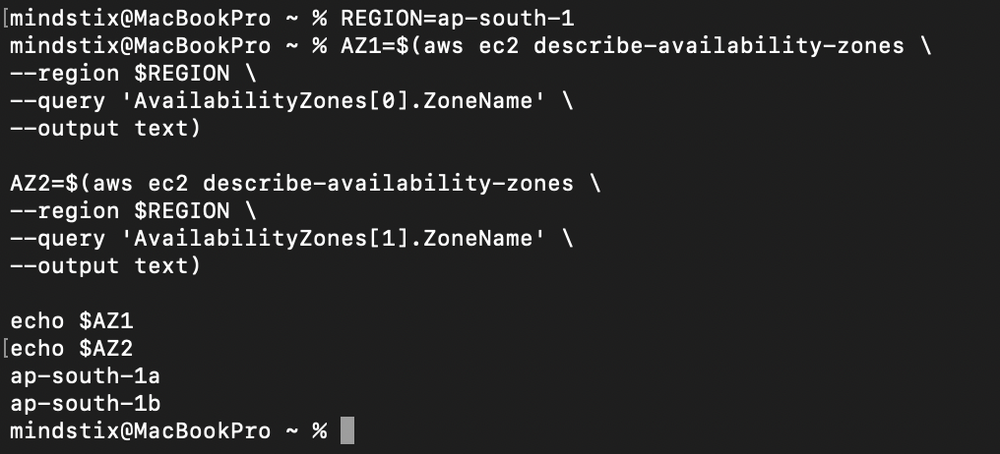

### 2. Create the VPC
```bash
VPC_ID=$(aws ec2 create-vpc \
--cidr-block 10.0.0.0/16 \
--region $REGION \
--query 'Vpc.VpcId' \
--output text)

echo $VPC_ID
```

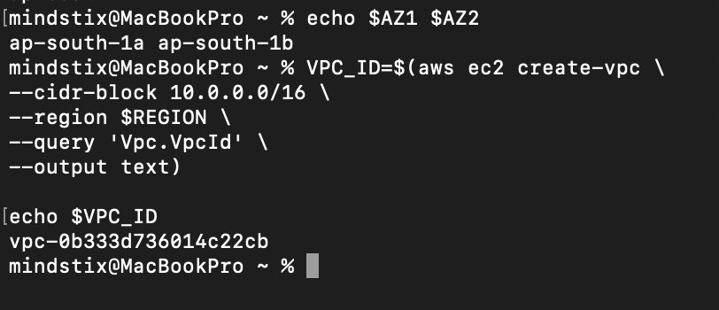

### 3. Create Public Subnets
#### Public Subnet A
```bash
PUB_SUBNET_A=$(aws ec2 create-subnet \
--vpc-id $VPC_ID \
--cidr-block 10.0.1.0/24 \
--availability-zone $AZ1 \
--region $REGION \
--query 'Subnet.SubnetId' \
--output text)

echo $PUB_SUBNET_A
```

#### Public Subnet B
```bash
PUB_SUBNET_B=$(aws ec2 create-subnet \
--vpc-id $VPC_ID \
--cidr-block 10.0.2.0/24 \
--availability-zone $AZ2 \
--region $REGION \
--query 'Subnet.SubnetId' \
--output text)

echo $PUB_SUBNET_B
```

#### Private Subnet A
```bash
PRIV_SUBNET_A=$(aws ec2 create-subnet \
--vpc-id $VPC_ID \
--cidr-block 10.0.3.0/24 \
--availability-zone $AZ1 \
--region $REGION \
--query 'Subnet.SubnetId' \
--output text)

echo $PRIV_SUBNET_A
```

#### Private Subnet B
```bash
PRIV_SUBNET_B=$(aws ec2 create-subnet \
--vpc-id $VPC_ID \
--cidr-block 10.0.4.0/24 \
--availability-zone $AZ2 \
--region $REGION \
--query 'Subnet.SubnetId' \
--output text)

echo $PRIV_SUBNET_B
```

### 4. Create Internet Gateway
```bash
IGW_ID=$(aws ec2 create-internet-gateway \
--region $REGION \
--query 'InternetGateway.InternetGatewayId' \
--output text)

echo $IGW_ID
```

### 5. Attach IGW to the VPC
```bash
aws ec2 attach-internet-gateway \
--internet-gateway-id $IGW_ID \
--vpc-id $VPC_ID \
--region $REGION
```

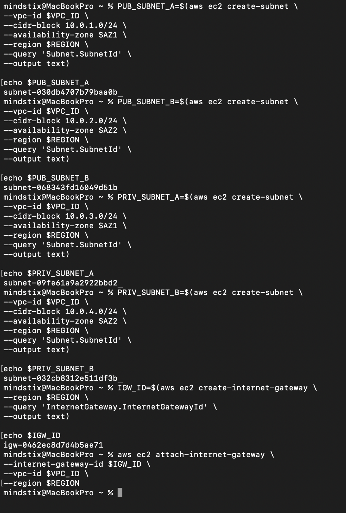


### 6. Create Public Route Table
```bash
PUBLIC_RT=$(aws ec2 create-route-table \
--vpc-id $VPC_ID \
--region $REGION \
--query 'RouteTable.RouteTableId' \
--output text)

echo $PUBLIC_RT
```

### 7. Add the Route to the IGW
```bash
aws ec2 create-route \
--route-table-id $PUBLIC_RT \
--destination-cidr-block 0.0.0.0/0 \
--gateway-id $IGW_ID \
--region $REGION
```

### 8. Associate the Public Route Table to Public Subnets
```bash
aws ec2 associate-route-table \
--route-table-id $PUBLIC_RT \
--subnet-id $PUB_SUBNET_A \
--region $REGION

aws ec2 associate-route-table \
--route-table-id $PUBLIC_RT \
--subnet-id $PUB_SUBNET_B \
--region $REGION
```

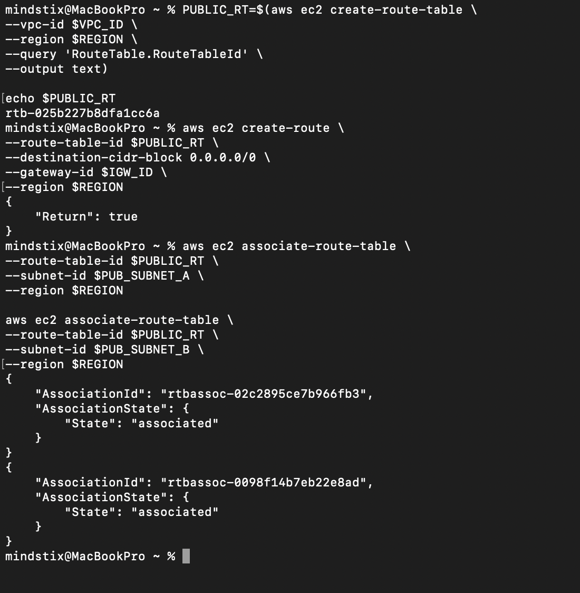


### 9. Create the Private Route Table
```bash
PRIVATE_RT=$(aws ec2 create-route-table \
--vpc-id $VPC_ID \
--region $REGION \
--query 'RouteTable.RouteTableId' \
--output text)

echo $PRIVATE_RT
```

### 10. Associate the Private Route to the Private Subnet
```bash
aws ec2 associate-route-table \
--route-table-id $PRIVATE_RT \
--subnet-id $PRIV_SUBNET_A \
--region $REGION

aws ec2 associate-route-table \
--route-table-id $PRIVATE_RT \
--subnet-id $PRIV_SUBNET_B \
--region $REGION
```

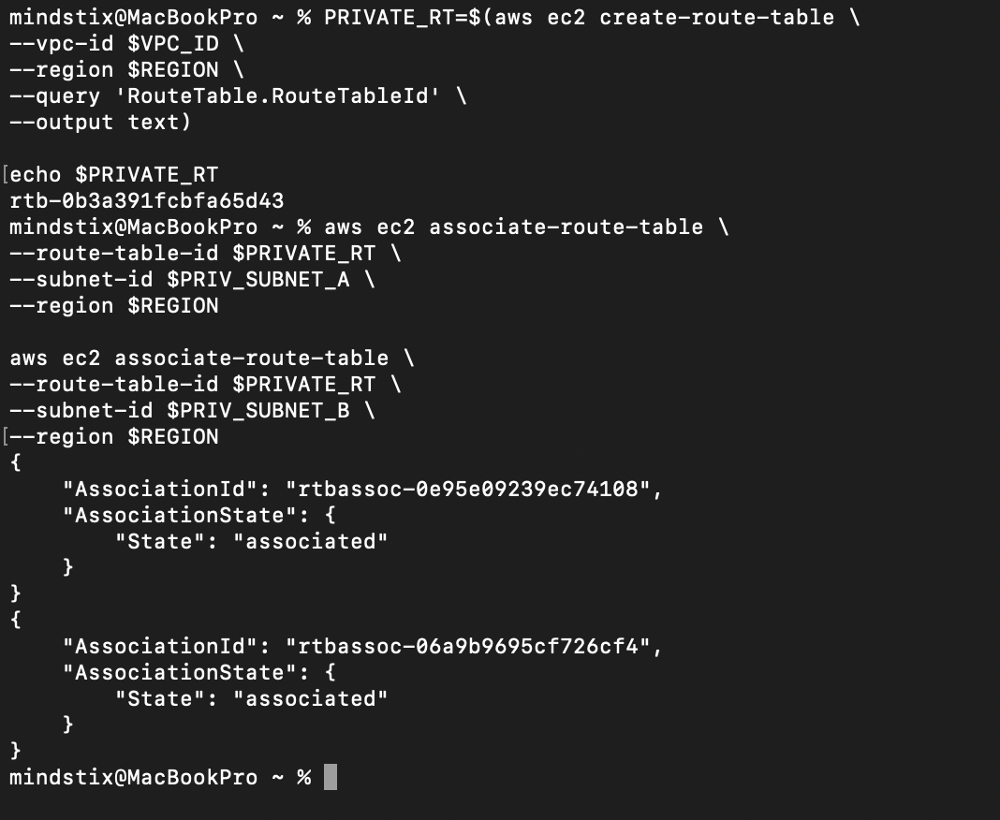


## Verify
### 1. Describe Subnets
```bash
aws ec2 describe-subnets \
--filters "Name=vpc-id,Values=$VPC_ID" \
--region $REGION
```

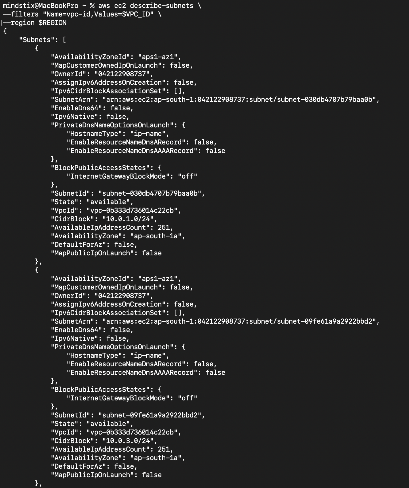
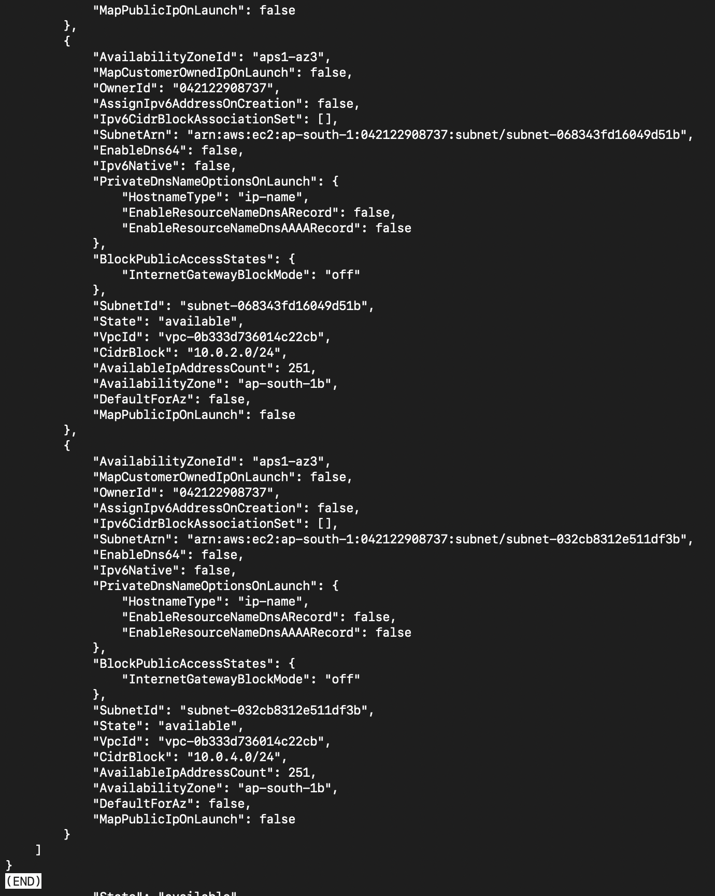

### 2. Verify IGW
```bash
aws ec2 describe-internet-gateways \
--filters "Name=attachment.vpc-id,Values=$VPC_ID" \
--region $REGION
```

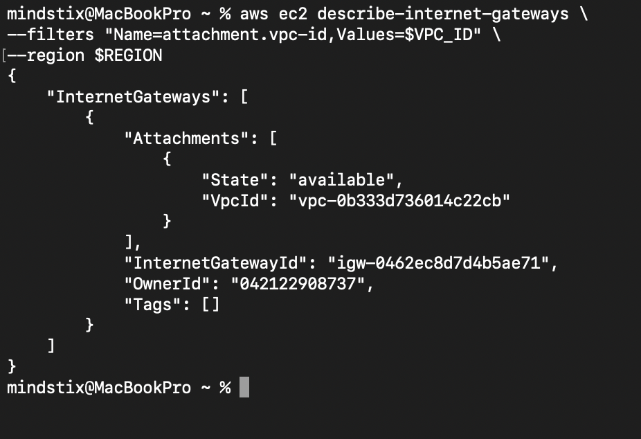

### Verify Route Table
```bash
aws ec2 describe-route-tables \
--filters "Name=vpc-id,Values=$VPC_ID" \
--region $REGION
```

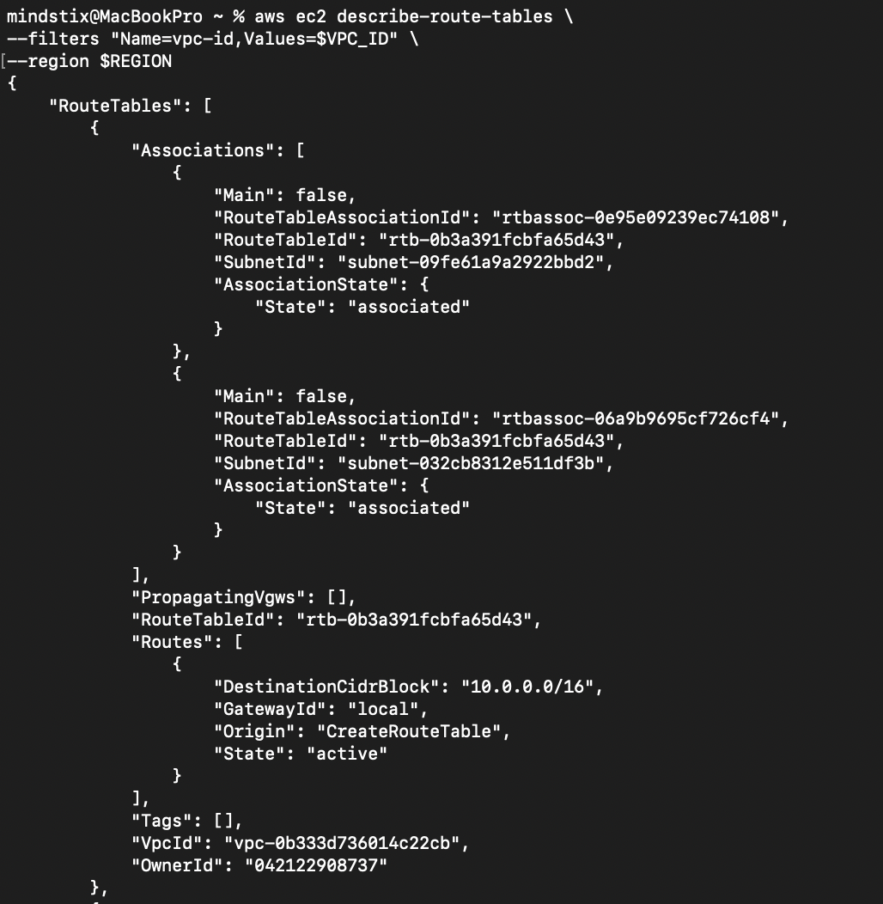
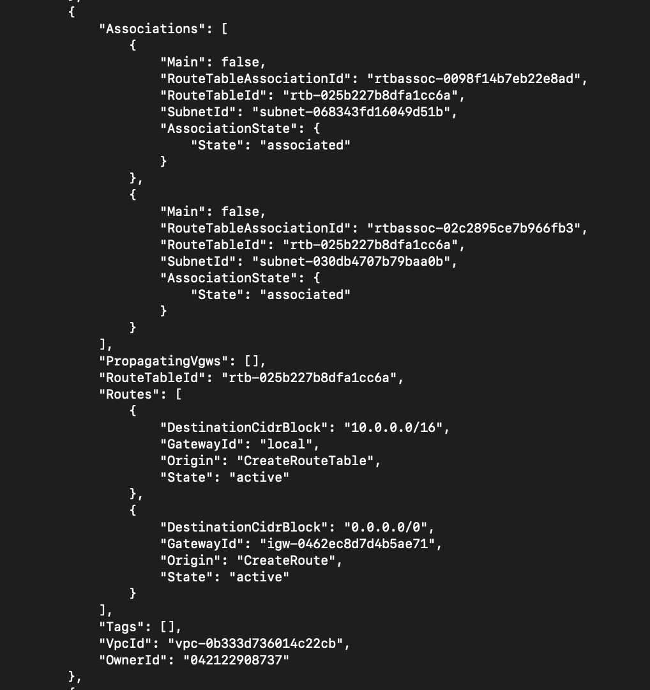
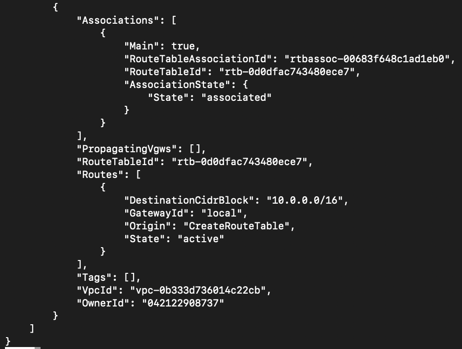

### Verify Using Console
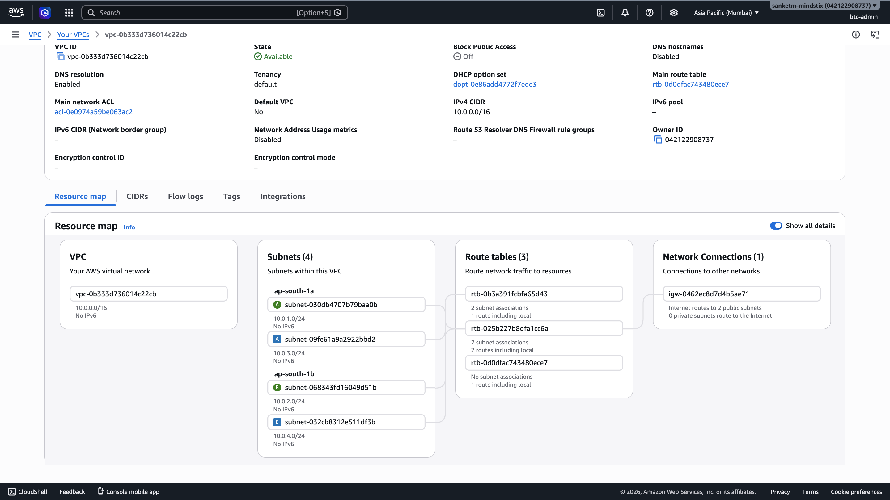


### Question for your log: Walk through the 5-step checklist for this scenario: you launch an EC2 in Private Subnet A and try to SSH from your laptop. At which step does it fail? What specifically is missing?
In the private subnet, it does not have a route to IGW, that is why even the ec2 has the Public IP we won't be able to SSH

When we try to SSH using EC2's Public IP, the request reaches the VM (Assuming that the port 22 is configured properly),.
The EC2 receives the packet and tries to send a response back to your laptop.

But now the subnet route table is checked.
The destination is outside the VPC, so AWS looks for 0.0.0.0/0 -> IGW
So the return traffic has nowhere to go.
And the SSH fails

