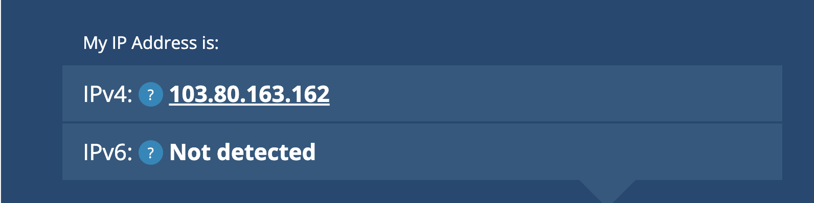
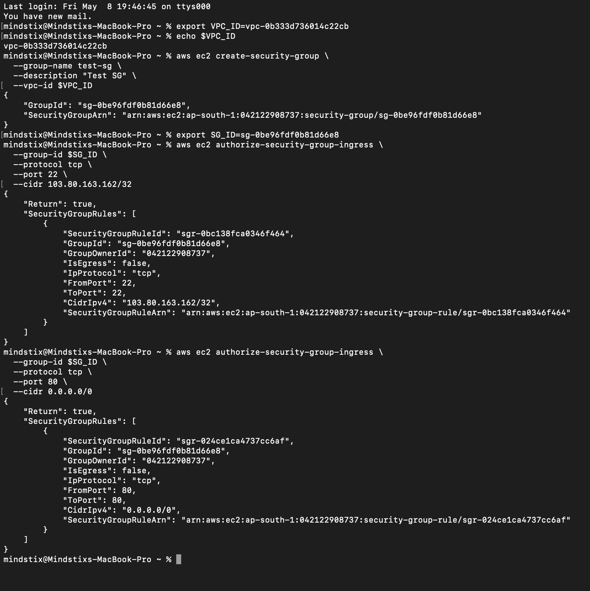
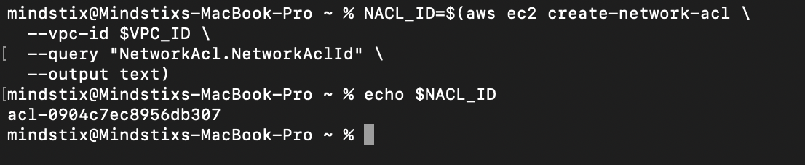
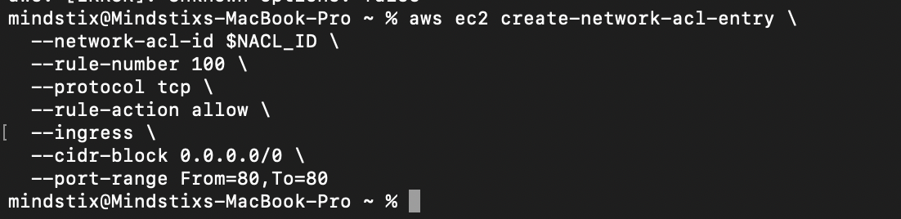
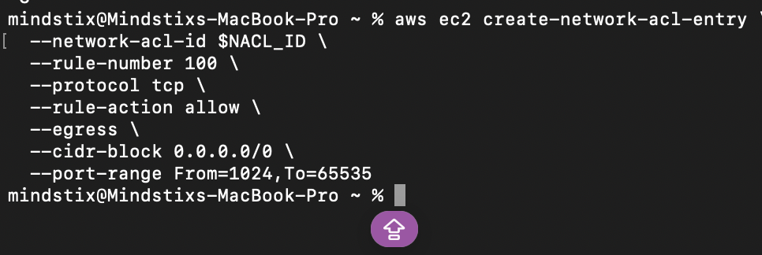
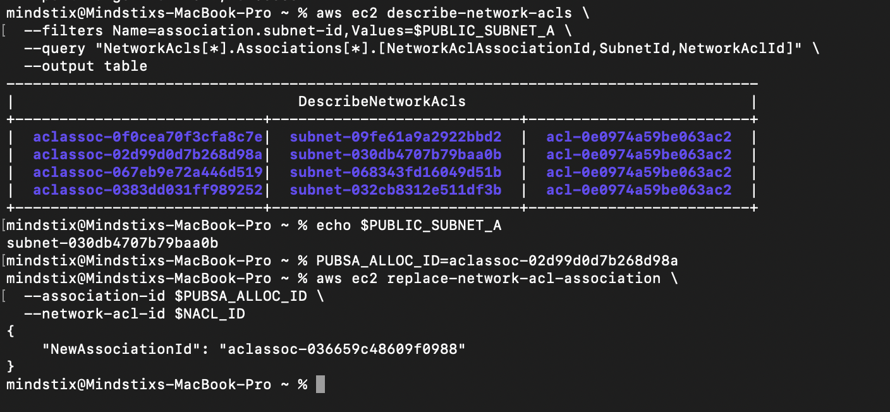
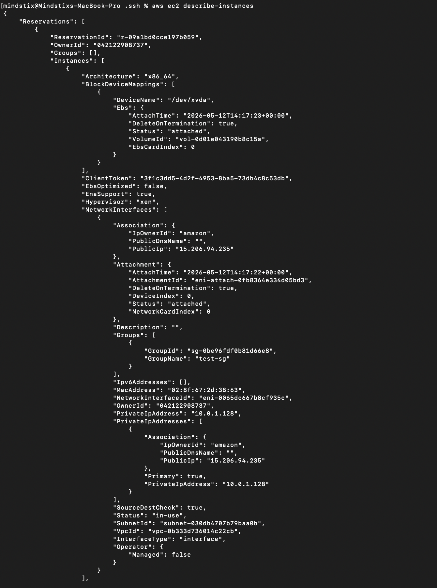
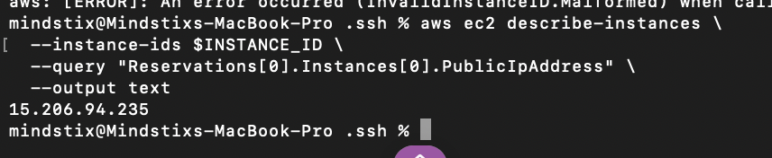
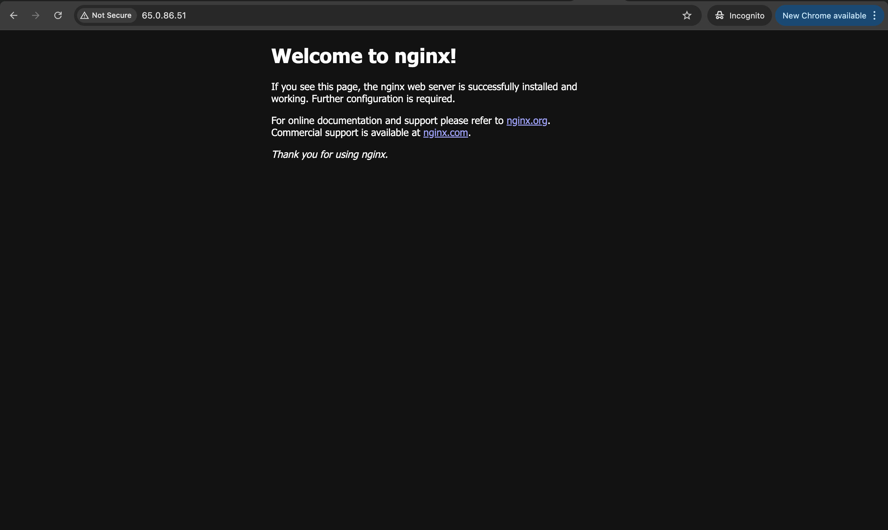
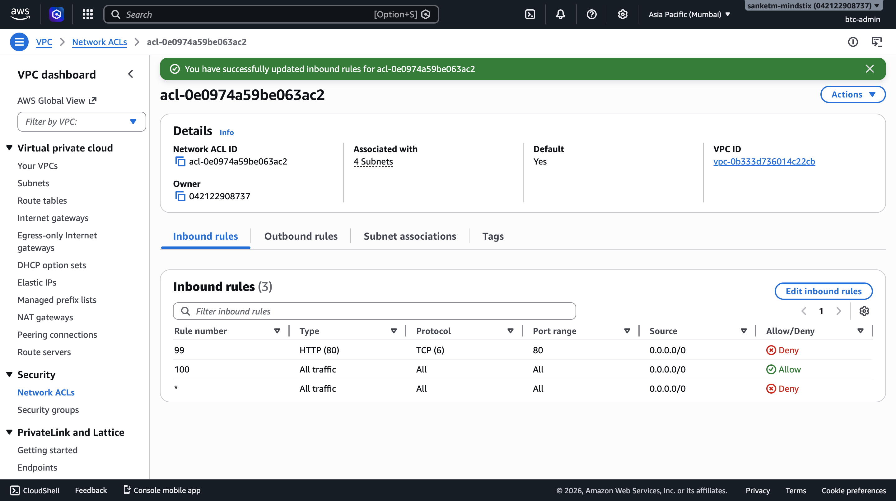

### 1. Create a Security Group in your VPC. Allow inbound port 22 from your IP only. Allow inbound port 80 from anywhere (0.0.0.0/0).
My Public IP [103.80.163.162]


2. Create the Security Group
```bash
aws ec2 create-security-group \
  --group-name test-sg \
  --description "Test SG" \
  --vpc-id $VPC_ID
```

3. Add Inbound Rule to port 22
```bash
aws ec2 authorize-security-group-ingress \
  --group-id $SG_ID \
  --protocol tcp \
  --port 22 \
  --cidr 103.80.163.162/32
```

3. Allow inbound traffic to port 80
```bash
aws ec2 authorize-security-group-ingress \
  --group-id $SG_ID \
  --protocol tcp \
  --port 80 \
  --cidr 0.0.0.0/0
```



### 2. Create a custom NACL and attach it to Public Subnet A. Add: inbound allow port 80, outbound allow ports 1024–65535 (ephemeral ports — look up why these are needed for stateless return traffic).
1. Create NACL
```bash
NACL_ID=$(aws ec2 create-network-acl \
  --vpc-id $VPC_ID \
  --query "NetworkAcl.NetworkAclId" \
  --output text)
```


2. Add NACL Rule
```bash
aws ec2 create-network-acl-entry \
  --network-acl-id $NACL_ID \
  --rule-number 100 \
  --protocol tcp \
  --rule-action allow \
  --ingress \
  --cidr-block 0.0.0.0/0 \
  --port-range From=80,To=80
```



3. Add NACL Outbound Rule
```bash
aws ec2 create-network-acl-entry \
  --network-acl-id $NACL_ID \
  --rule-number 100 \
  --protocol tcp \
  --rule-action allow \
  --egress \
  --cidr-block 0.0.0.0/0 \
  --port-range From=1024,To=65535
```



4. Attach the NACL to the PUBLIC Subnet A
Find the Association ID. WE cannot directly attach the NACL to the Subnet. We should replace the existing one. For that we need the association ID

```bash
aws ec2 describe-network-acls \
  --filters Name=association.subnet-id,Values=$PUBLIC_SUBNET_A \
  --query "NetworkAcls[*].Associations[*].[NetworkAclAssociationId,SubnetId,NetworkAclId]" \
  --output table
```

Attach the NACL
```bash
aws ec2 replace-network-acl-association \
  --association-id $PUBSA_ALLOC_ID \  
  --network-acl-id $NACL_ID    
```



#### look up why these are needed for stateless return traffic
Outbound Allow Ephemeral Ports

These are needed because NACLs are stateless.

When a client connects to port 80:
client source port = random port
server responds back to that port

So outbound ephemeral ports must be allowed.

Linux ephemeral range commonly: 1024–65535


### 3. Launch a small EC2 in Public Subnet A with this SG and the custom NACL. Install nginx via user data. Verify port 80 works.
How to find the supporeted AmI
A. Architecture support
Must be x86_64 AMI (not ARM/Graviton)

B. Virtualization type
Must be HVM (Hardware Virtual Machine) AMI

C. Boot mode compatibility
Must support:
UEFI OR
UEFI-preferred OR
Legacy BIOS fallback

D. Instance family capability

```bash
aws ec2 describe-instance-types \
  --instance-types t3.micro
```

Look for:
ProcessorInfo = x86_64
SupportedBootModes = legacy-bios, uefi
Hypervisor = nitro
NetworkInfo

1. Find the AMI Id
aws ec2 describe-images --owners amazon

2. Find the AMI id from the Parameter Store
https://docs.aws.amazon.com/AWSEC2/latest/UserGuide/finding-an-ami-parameter-store.html

```bash
aws ssm get-parameters \
  --names /aws/service/ami-amazon-linux-latest/al2023-ami-kernel-default-x86_64 \
  --query "Parameters[0].Value" \
  --output text
```

3. Generate the key
```bash
aws ec2 create-key-pair \
  --key-name my-key \
  --query 'KeyMaterial' \
  --output text > my-key.pem
```


3. Launch EC2 Instance
```bash
INSTANCE_ID=$(aws ec2 run-instances \
  --image-id $AMI_ID \
  --count 1 \
  --instance-type t3.micro \
  --key-name my-key \
  --security-group-ids $SG_ID \
  --subnet-id $PUBLIC_SUBNET_A \
  --associate-public-ip-address \
  --user-data file:///Users/mindstix/Desktop/Projects/sre-bootcamp-outputs/aws/day2/assignment-2b/userdata.sh \
  --query "Instances[0].InstanceId" \
  --output text)
```


4. Find the public IP
```bash
aws ec2 describe-instances \
  --instance-ids $AMI_ID \
  --query "Reservations[0].Instances[0].PublicIpAddress" \
  --output text
```



4. try the HTTP request to the Instance



### 4. Add a NACL deny rule for inbound port 80 with a lower rule number than your allow rule. Refresh. Does port 80 still work? Why?


No. Becuase the request cannot reach the port 80 of the VM. The Traffic is denied at the subnet level.

We get the Site Cannot be Reached Error

### 5. Remove the NACL deny. Try to add a deny rule to the Security Group. Can you?
We cannot add the deny rule to SG. SG denies the traffic implicity if not explicitly allowed.


### 6. Question for your log: A Security Group allows port 80 inbound. The NACL on the same subnet denies port 80 inbound. What is the result and why? Now reverse — NACL allows, SG denies. What is the result?
In both the cases, the request will be blocked.


Try 
Start and Stop EC2 and check if the Public is changing. 