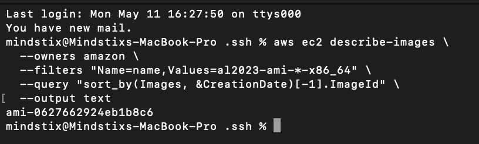
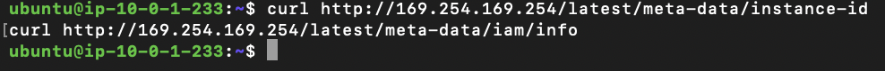
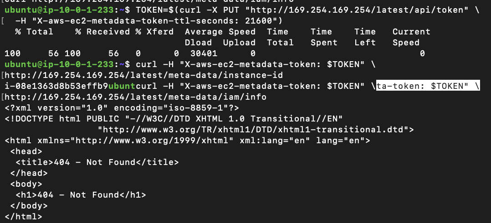
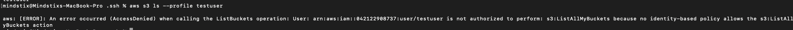

### Find the latest Amazon Linux 2023 AMI ID for your region:
```bash
aws ec2 describe-images \
  --owners amazon \
  --filters "Name=name,Values=al2023-ami-*-x86_64" \
  --query "sort_by(Images, &CreationDate)[-1].ImageId" \
  --output text
```




### Launch a t2.micro in Public Subnet A of your VPC. Use CLI. Associate a public IP.
### SSH into it using your key pair.
### From inside the instance, run:
curl http://169.254.169.254/latest/meta-data/instance-id
curl http://169.254.169.254/latest/meta-data/iam/info


Getting empty responses for the above curls

After searching the issue, found out that the ec2 instance uses IMDSv2, so the above requests needs token to work properly
To get the token
```bash
TOKEN=$(curl -X PUT "http://169.254.169.254/latest/api/token" \
  -H "X-aws-ec2-metadata-token-ttl-seconds: 21600")
```

Then after trying the request with the token, it worked
```bash
curl -H "X-aws-ec2-metadata-token: $TOKEN" \
http://169.254.169.254/latest/meta-data/instance-id
```

```bash
curl -H "X-aws-ec2-metadata-token: $TOKEN" \ta-token: $TOKEN" \
http://169.254.169.254/latest/meta-data/iam/info
```



https://docs.aws.amazon.com/AWSEC2/latest/UserGuide/configuring-instance-metadata-service.html

### What is 169.254.169.254? What does it return? (Docs: https://docs.aws.amazon.com/AWSEC2/latest/UserGuide/ec2-instance-metadata.html)
This is the local IP Address used to access the meta data of the instance.


### Try aws s3 ls. What error do you get? Apply Step 4 of the debugging checklist and explain the failure.


The IAM User specifically has only the EC2 Read access, that is why it cannot do the s3 operations