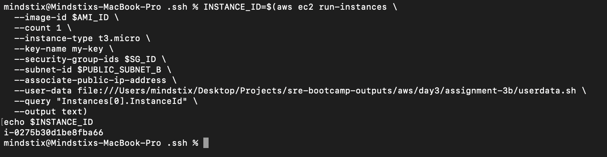
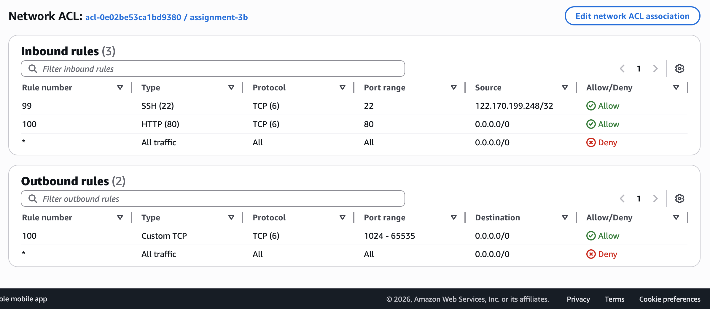
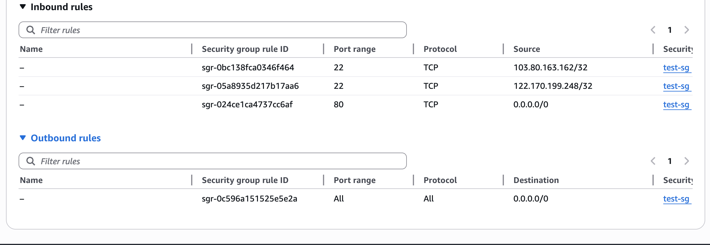
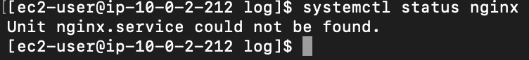
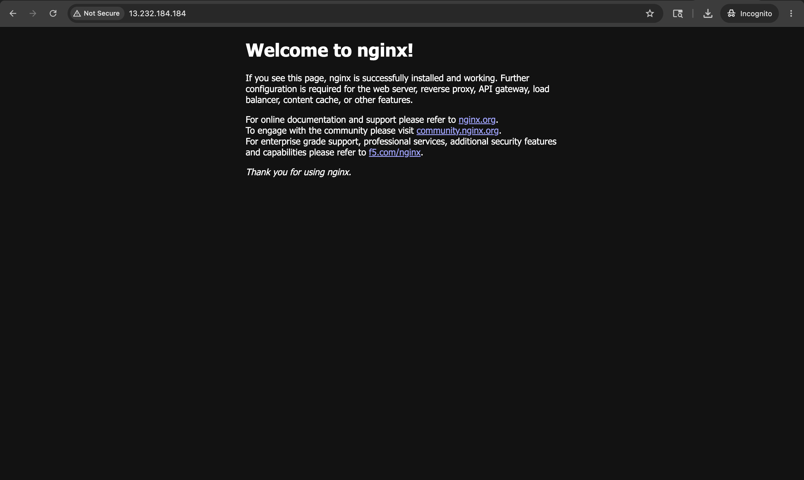
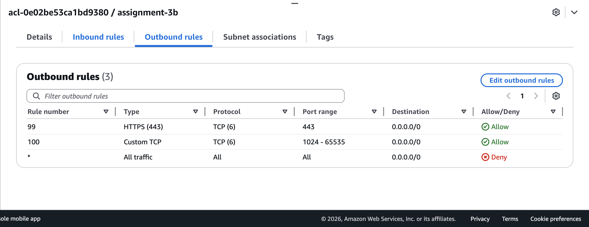
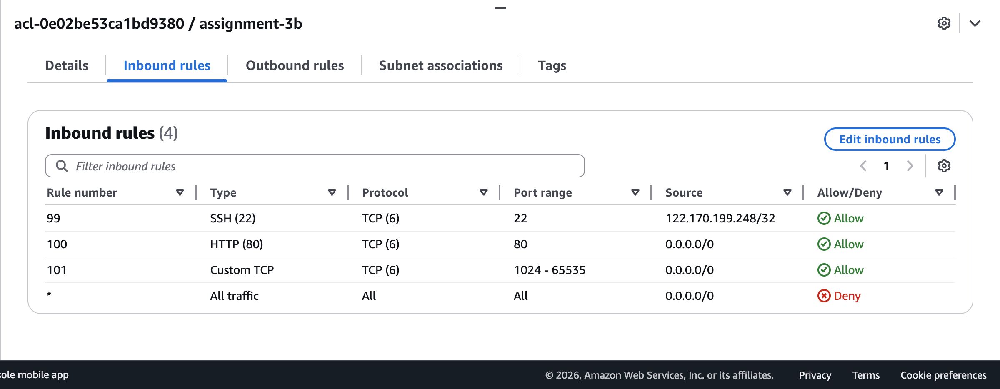
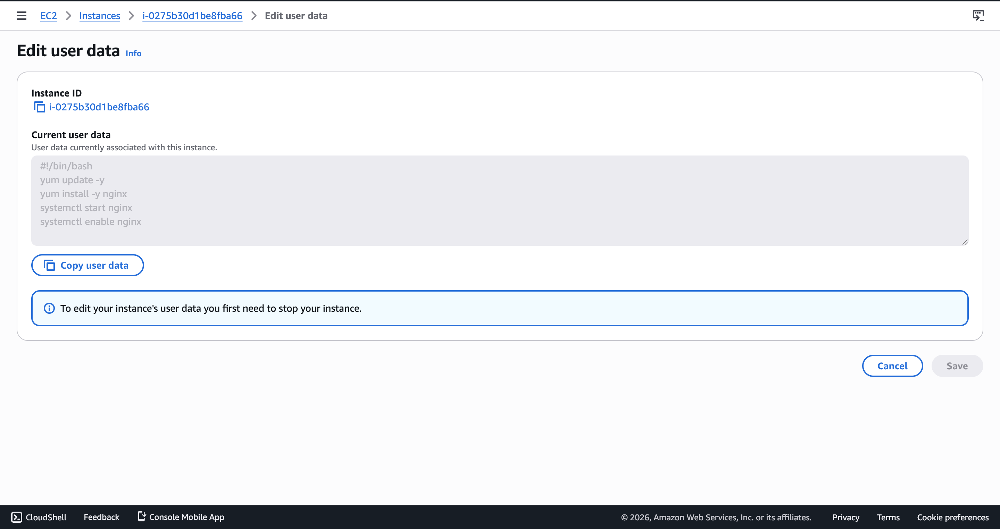

## Assignment 3B — User Data
### User data execution details: https://docs.aws.amazon.com/AWSEC2/latest/UserGuide/user-data.html
Launch a new EC2 with this user data:
```bash
#!/bin/bash
yum update -y
yum install -y nginx
systemctl start nginx
systemctl enable nginx
```

1. Find the AMI 
```bash
AMI_ID=$(aws ec2 describe-images \
  --owners amazon \
  --filters "Name=name,Values=al2023-ami-*-x86_64" \
  --query "sort_by(Images, &CreationDate)[-1].ImageId" \
  --output text)
```

2. Launch the instance in the Public Subnet B
```bash
INSTANCE_ID=$(aws ec2 run-instances \
  --image-id $AMI_ID \
  --count 1 \
  --instance-type t3.micro \
  --key-name my-key \
  --security-group-ids $SG_ID \
  --subnet-id $PUBLIC_SUBNET_B \
  --associate-public-ip-address \
  --user-data file:///Users/mindstix/Desktop/Projects/sre-bootcamp-outputs/aws/day3/assignment-3b/userdata.sh \
  --query "Instances[0].InstanceId" \
  --output text)
echo $INSTANCE_ID
```



### After launch, try to reach the instance's public IP on port 80 in your browser. Does it work?
It does not work. 

### If it doesn't — apply the 5-step checklist. Do not read ahead. Write down which step identifies the problem and what you changed.
1. The NACL has the inbound and outbound traffic enabled


2. The SG allows the inbound traffic to port 80, allows port 22 to my public IP and allows all outbound traffic


3. After ssh into VM, understood that nginx service was not installed


4. For the yum install nginx, it sends the https request, but our NACL does not allow outbound request to those ports. Also, the inbound rule should allow the ephemeral ports, in order to get the response properly


5. After enabling the ports in NACL, http request ran successfully




### Once port 80 works, SSH in and examine: cat /var/log/cloud-init-output.log. What does this file contain? Bookmark this — you'll need it in Day 5.
`/var/log/cloud-init-output.log` contains the stdout/stderr output generated during EC2 instance initialization and User Data script execution by cloud-init.

It typically contains:

* User Data script execution logs
* Package installation output (`yum` / `dnf`)
* Network/DNS/repository errors
* Service start/enable logs
* Command stdout and stderr
* cloud-init module execution progress
* Boot-time automation/debugging information

### Try to edit user data on the running instance (via console: Actions → Instance Settings → Edit user data). What does AWS tell you? What must you do first?
AWS asks us to stop the instance in order to change the userdata


