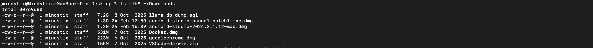
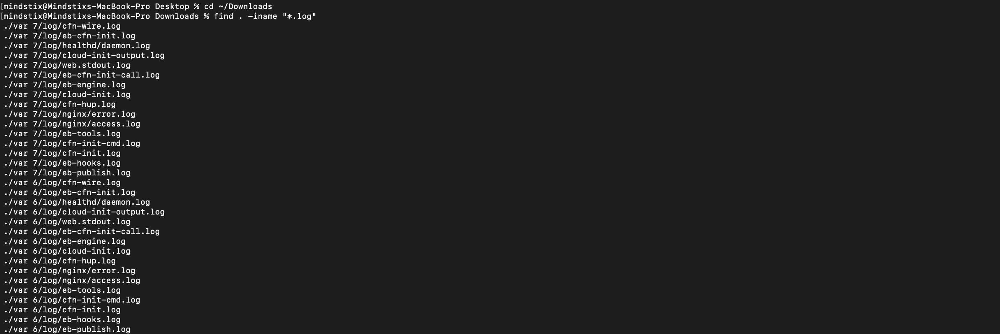
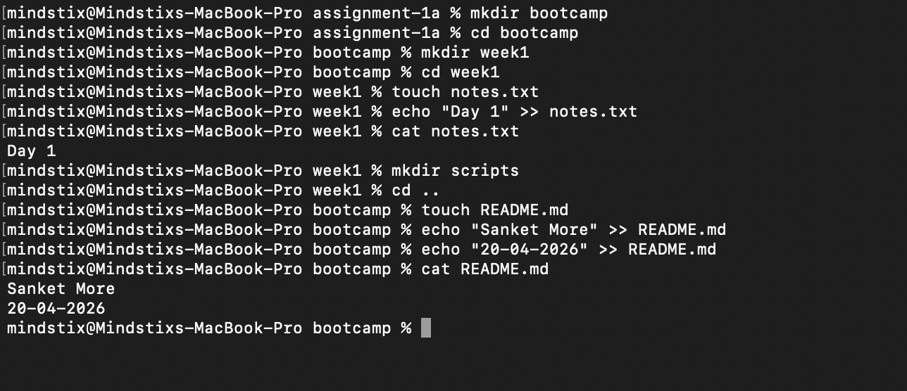
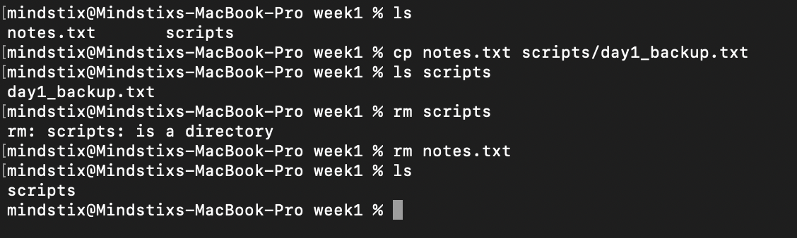
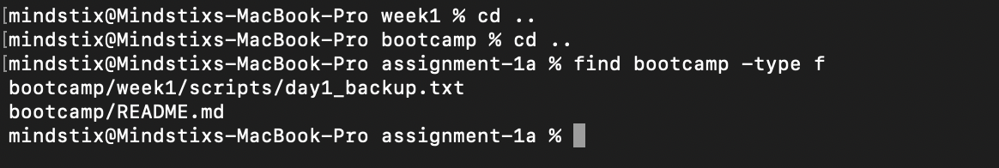
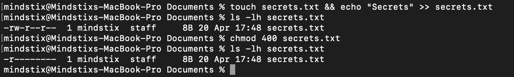
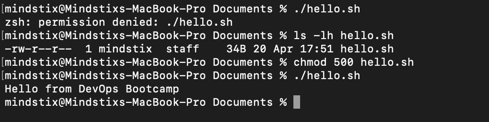

# Task 1 - Find the 5 Largest Files Under `/var`

To list files sorted by size, I used:

I am listing the files under Downloads Directory since I am on the MacOS

```bash
ls -lhS ~/Downloads
```

Explanation of Flags
-l - Shows detailed (long) listing format
-h - Displays sizes in human-readable format (KB, MB, GB)
-S - Sorts files by size (largest first)


It is not possible to limit the output to 5 fils only with the help of the ls command as per my findings!

Output


# Task 2 - Find every file named *.log under /var/log. Use find.
Used the 'find' command
```bash
find . -iname "*.log"
```

Output


# Task 3 - Create the following structure in your home directory:
List of commands used
```bash
mkdir bootcamp
cd bootcamp 
mkdir week1
cd week1 
touch notes.txt
echo "Day 1" >> notes.txt
cat notes.txt
mkdir scripts
cd ..
touch README.md
echo "Sanket More" >> README.md 
echo "20-04-2026" >> README.md 
cat README.md 
```

Output


# Task 4 - Copy notes.txt into scripts/, then rename the copy to day1_backup.txt.
# Task 5 - Delete notes.txt from week1/ but NOT the backup.
List of commands used
```bash
cp notes.txt scripts/day1_backup.txt
rm scripts 
```
Output



# Verify
command
```bash
find bootcamp -type f
```



# File Users and Permisssions
Create a file called secret.txt in your home directory with some text in it.
Set permissions so that ONLY you can read and write it. No one else can even read it.

Output


# Creating a bash script
Create a shell script hello.sh that prints "Hello from DevOps Bootcamp". Try running it with ./hello.sh. It will fail. Figure out why and fix it without using bash hello.sh

Output


# Executing bash script without read permission
The user cannot run a script without read permission even though it has execute permission because to run a script it must be first loaded by the system (kernal) for which it should have the read permission

# Create a directory shared/. Set permissions so anyone can enter the directory and read files, but only you can write to it. What numeric chmod value achieves this?
The numeric code used will be 644

- 4 -> read
- 2 -> write
- 1 -> execute