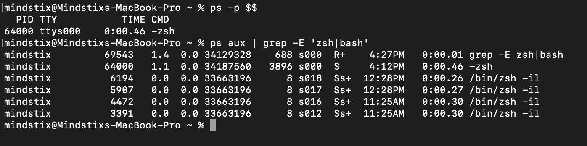
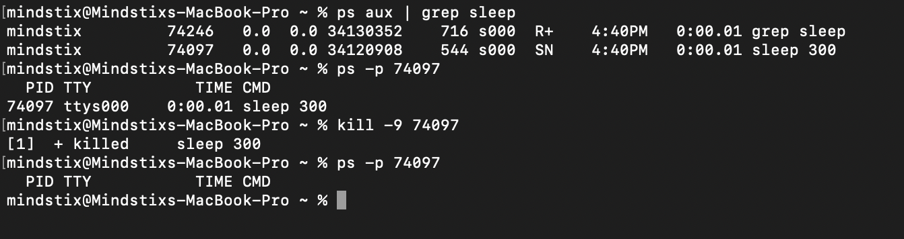
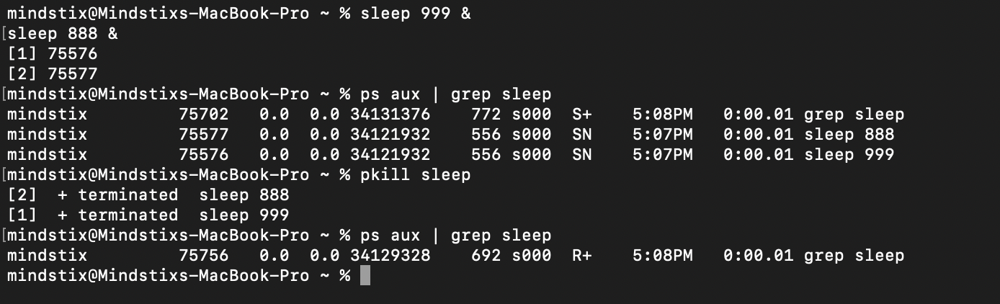

### Find the PID of your shell process. 

\$$ gives you the pid of the current running shell or script

To find the process using ps we can use the following commands 

```bash
ps -p $$

ps aux | grep -E 'zsh|bash'
```

Output 



## Run sleep 300 &
```bash
sleep 300 &
```
& runs the process in the background
You immediately get your prompt back

Without &:
```bash
sleep 300
```
Runs in the foreground

Your terminal is blocked for 300 seconds (5 minutes)

## Find the pid for the sleep process

```bash
ps aux | grep 'sleep'
```

this commands finds all the processes named sleep

Also, when we execute the sleep command, we get the pid of the process as the output. We can also search by pid using -p flag

Output


## find ppid of the sleep process
```bash
ps -f | grep sleep
```

the third column is the ppid which is same as the shell pid

## Kill sleep process
```bash
kill -9 <pid>
```

Output


## Run sleep 999 & and sleep 888 &. Kill both with a single command. (Research: is there a way to kill by name instead of PID?)

```bash
pkill sleep
```

This command takes the process name as a parameter and kills all the processes with the same name

Output


## Open top. While it's running, answer these in your log:
### - Which process is using the most CPU right now?
Look at the %CPU column
The process at the top (sorted) is using the most CPU

### - What does the load average line at the top mean? (Look it up.)
**Load average** is **not CPU usage**.  
It is the **average number of processes that are either:**

1. **Running on the CPU**, or  
2. **Waiting to run (in the run queue)**

over a period of time.

### The 3 numbers

Example:

load average: 0.80, 1.20, 2.00


| Value | Time Window | Meaning |
|------|------------|--------|
| 0.80 | 1 minute   | Recent load |
| 1.20 | 5 minutes  | Short-term trend |
| 2.00 | 15 minutes | Long-term trend |

👉 These are **exponentially weighted moving averages**, not simple averages.

---

## What counts toward load?

A process contributes to load if it's in:

| State | Description | Counts? |
|------|------------|--------|
| Running (R) | Actively using CPU | Yes |
| Runnable | Ready but waiting for CPU | Yes |
| Uninterruptible sleep (D) | Waiting on disk I/O (e.g., disk read) | Yes |
| Sleeping (S) | Idle / waiting (e.g., `sleep`) | No |
| Zombie (Z) | Dead but not reaped | No |

👉 Important insight:  
**I/O wait (disk bottlenecks) increases load even if CPU is idle**

---

## Interpreting load average

### Rule of thumb:
Compare load to **number of CPU cores**

Check cores:
```bash
nproc
```

Example: 4-core system
Load	Interpretation
1.0	Light usage
4.0	Fully utilized
>4.0	Overloaded (processes waiting)
### Example scenarios
#### Healthy system
load average: 1.0, 1.1, 1.2   (on 4 cores)
Plenty of headroom

#### Increasing load
load average: 1.0, 2.5, 3.8
Load is decreasing over time
System recovering

#### Overloaded system
load average: 6.0, 5.5, 5.0   (on 4 cores)
More processes than CPU can handle
Queue is forming → slowdown

### Why 3 time windows?

They help detect trends:

Pattern	Meaning
1m > 5m > 15m	Load increasing (spike)
1m < 5m < 15m	Load decreasing
All equal	Stable system

### - Press M inside top. What changes?
Sorts processes by memory usage (%MEM) instead of CPU