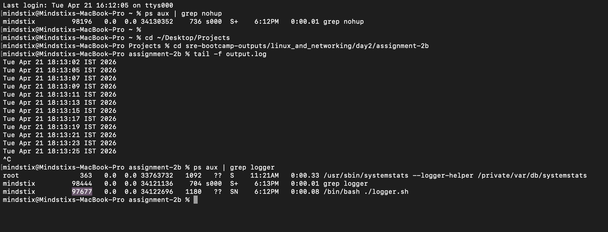

### Write a small shell script logger.sh that runs in an infinite loop, appending the current timestamp to a file output.log every 2 seconds:
```bash
while true; do
  echo "$(date)" >> output.log
  sleep 2
done
```
- Run it using nohup so it survives terminal close. Note its PID.
- Close your terminal and reopen it. Is the process still running? Verify with ps.
- Use tail -f output.log to watch it write in real time.
- Check how much disk space your home directory is using with du.
- Kill the background process. Verify output.log stopped growing.


Output

