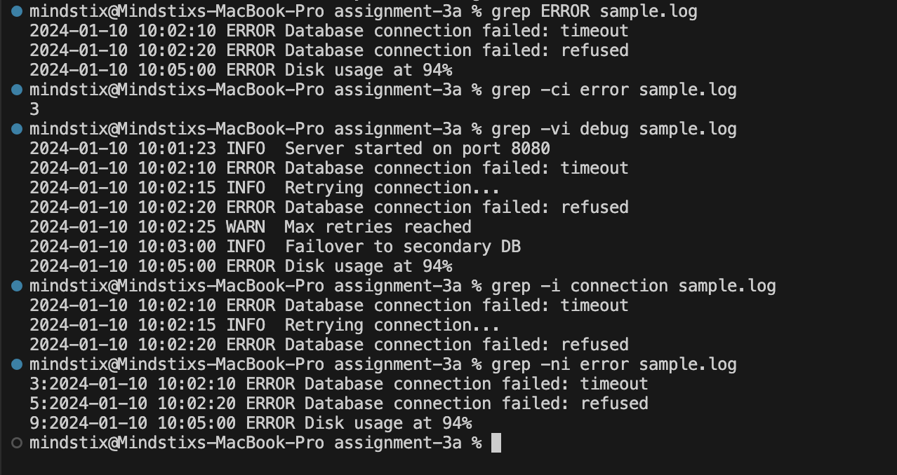

Create a file sample.log with this content:

2024-01-10 10:01:23 INFO  Server started on port 8080
2024-01-10 10:01:45 DEBUG Health check passed
2024-01-10 10:02:10 ERROR Database connection failed: timeout
2024-01-10 10:02:15 INFO  Retrying connection...
2024-01-10 10:02:20 ERROR Database connection failed: refused
2024-01-10 10:02:25 WARN  Max retries reached
2024-01-10 10:03:00 INFO  Failover to secondary DB
2024-01-10 10:03:05 DEBUG Query executed in 23ms
2024-01-10 10:05:00 ERROR Disk usage at 94%
Answer these using only grep commands (one command per question):

### Show only ERROR lines.
```bash
grep -i error sample.log
```

### Count how many ERROR lines there are.
```bash
grep -ni error sample.log
```

### Show all lines that are NOT DEBUG.
```bash
grep -vi debug sample.log
```

### Find all lines mentioning "connection" — case insensitive.
```bash
grep -i connection sample.log
```

### Show ERROR lines with their line numbers.
```bash
grep -in error sample.log
```

Output
