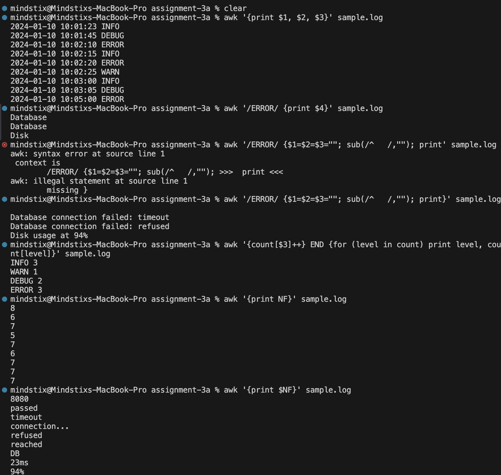

Using the same sample.log:

### Print only the timestamps and log levels for every line.
```bash
awk '{print $1, $2, $3}' sample.log 
```

### Print the full message only for ERROR lines.
```bash
awk '/ERROR/ {$1=$2=$3=""; sub(/^   /,""); print}' sample.log
```

#### sub(regex, replacement, target)
Replaces first match of regex with replacement
If target is omitted → defaults to $0 (entire line)

### Count how many times each log level appears. (Hint — look up awk associative arrays.)
```bash
awk '{count[$3]++} END {for (level in count) print level, count[level]}' sample.log
```

### Print the last column of every line.
```bash
awk '{print $NF}' sample.log
```

Output
