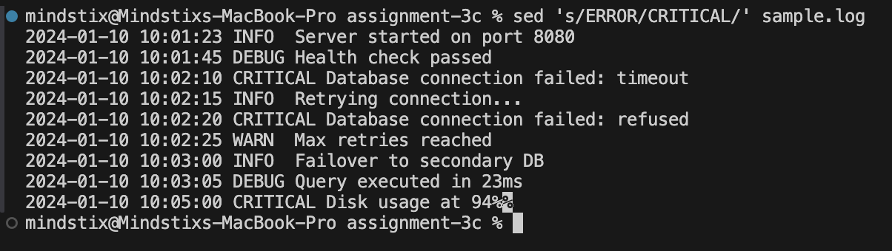
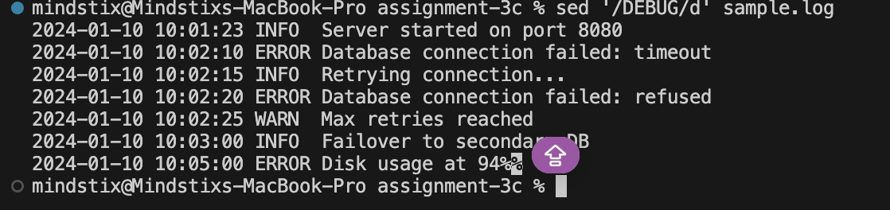
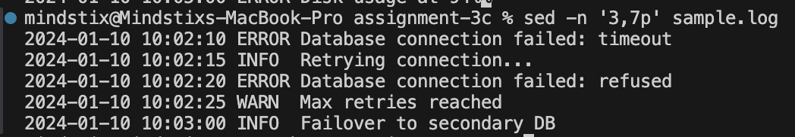
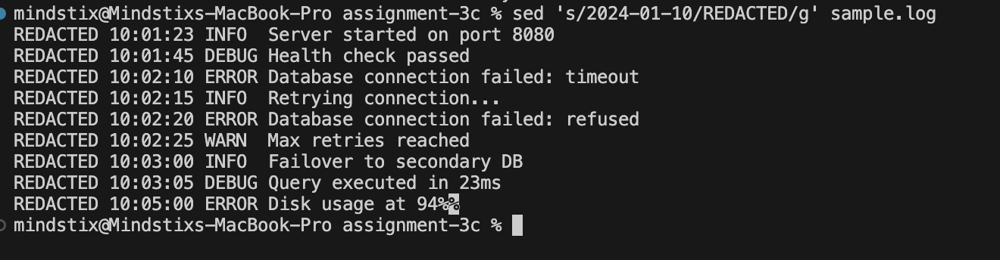

### Replace all occurrences of ERROR with [CRITICAL] in sample.log and print the result (don't modify the file).
```bash
sed 's/ERROR/CRITICAL/' sample.log 
```

Output -


### Now do the same but store it in the new file (sample_sed.log)
```bash
sed 's/ERROR/CRITICAL/' sample.log > sample_sed.log   
```

we can use the -i.bkp flag as well instead or redirecting the output to the new file
but this will modify the sample.log file and backup the original content to the sample.log.bkp file

Output -
check the sample_sed.log file

### Delete all DEBUG lines from the output.
```bash
sed '/DEBUG/d' sample.log
```

Output -


### Print only lines 3–7.
```bash
sed -n '3,7p' sample.txt
```

Output -


Note -
```bash
sed '3,7!d' file.txt
```

Delete all lines except 3 to 7

### Replace the date 2024-01-10 with REDACTED throughout the file.
```bash
sed 's/2024-01-10/REDACTED/g' sample.log 
```

Output -

