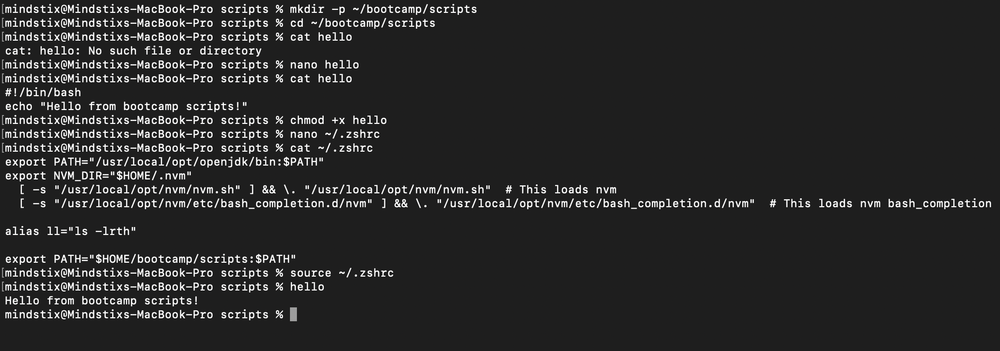
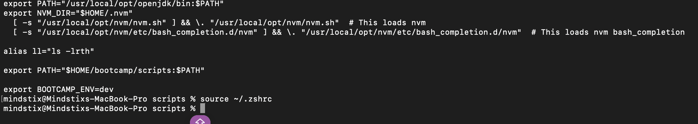
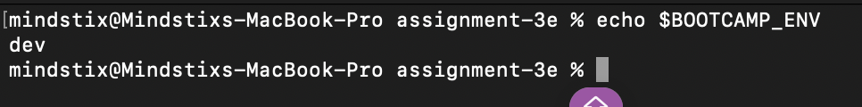
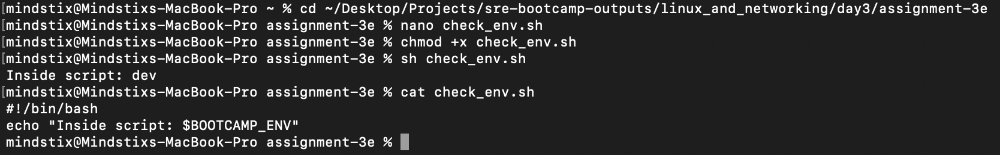

## Assignment 3E — Shell Configuration
### Add a permanent alias ll that runs ls -lrth. Make it survive a terminal restart.
1. Open .zshrc
```bash
nano ~/.zshrc
```

2. Add the alias
```bash
alias ll='ls -lrth'
```

3. Source
```bash
source ~/.zshrc
```

4. Try the ll command

### Add ~/bootcamp/scripts to your PATH permanently. Verify by placing a script there and running it by name without its full path.
Output


### Set a permanent environment variable BOOTCAMP_ENV=dev. Verify it's available in a new terminal AND in a child process (run env from inside a script, not just the shell).
Set env variable
Output


Check env var in new terminal
Output


Check child process
Output 


### Exploration question for your log: What's the difference between ~/.bashrc and ~/.bash_profile (or .zshrc and .zprofile)? When does each one run? Why does this matter?

There are 2 type of shell sessions

1. Login Shell - Starts when you log in into the system
2. Interactive Non login Shell - Starts when you opens a Terminal or Interactive shell

.bash_profile and .zprofile (MacOS) runs for the login shell
.bashrc and .zshrc (MacOS) runs for the Interactive Non Login Shell

#### On macOS Terminal (default behavior)
When you open Terminal:
It usually starts a login + interactive shell

So:
.zprofile → .zshrc

Both get executed.

##### When you run a script
./script.sh
This is non-interactive
Neither .zshrc nor .zprofile is guaranteed to run

-> That’s why scripts often don’t see your aliases


### LINUX

| Shell type                      | Example                                   |
| ------------------------------- | ----------------------------------------- |
| **Login shell**                 | SSH login, TTY login (`Ctrl+Alt+F2`)      |
| **Interactive non-login shell** | Opening a terminal (GNOME Terminal, etc.) |
| **Non-interactive shell**       | Running a script (`bash script.sh`)       |

#### Login shell reads ONE of these:
~/.bash_profile
~/.bash_login
~/.profile

It reads the first one that exists (in that order)

#### Interactive non-login shell → reads:
~/.bashrc

#### Non-interactive shell (scripts)
Does NOT read .bashrc or .bash_profile by default


### Important behavior difference (Linux vs macOS)

On Linux, .bashrc is usually NOT loaded automatically in login shells

So you often see this inside .bash_profile:
```bash
# ~/.bash_profile
if [ -f ~/.bashrc ]; then
  . ~/.bashrc
fi
```

This ensures:
login shell ALSO gets aliases/functions from .bashrc