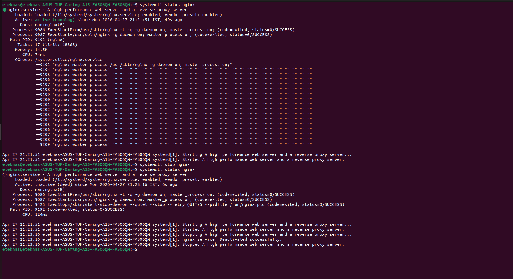
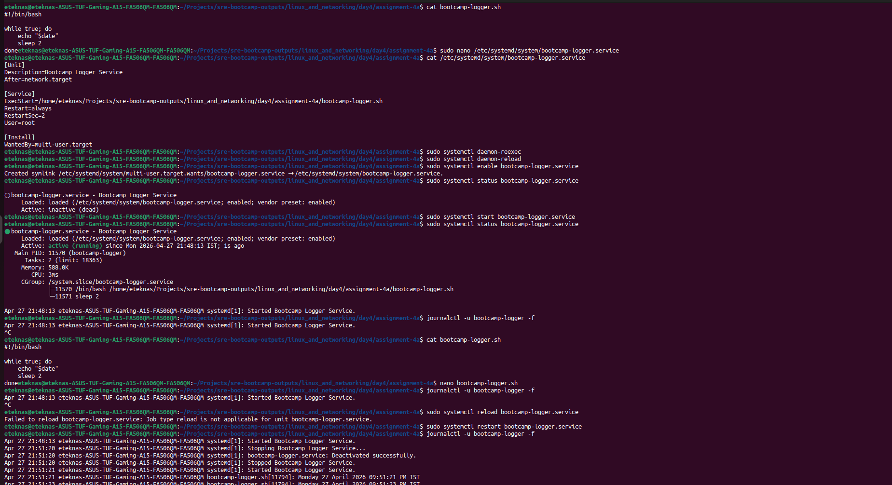
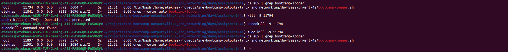

## Assignment 4A — Systemd Service
1. Install nginx if it's not installed (sudo apt install nginx or equivalent).
2. Check its status. Is it running? Is it enabled on boot?
3. Stop it. Verify it's stopped. Start it again.

Output

4. Now write your own systemd unit file for the logger.sh script you wrote on Day 2. Place it in /etc/systemd/system/bootcamp-logger.service. The service should:
Start automatically on boot
Restart automatically if it crashes
Log output via journald (remove the file redirection from the script)
Enable and start your service. Verify it's running with systemctl status.
Kill the underlying process directly with kill -9. Watch what happens. Does systemd restart it?
View its logs with journalctl -u bootcamp-logger -f.

Creating logger service

Killing the logger-service and it restarted again automatically

### Reflection questions:
1. What's the difference between restart and reload?
### What it does: Completely stops the service and then starts it again.
All processes are killed and restarted fresh.
Any in-memory state is lost.
New configuration is loaded because the service starts from scratch.
#### Use when:
The service is stuck or misbehaving.
You changed configs and the service doesn’t support reload.
You want a clean reset.

2. What does WantedBy=multi-user.target mean in a unit file? (Look at an existing unit file for reference.)
