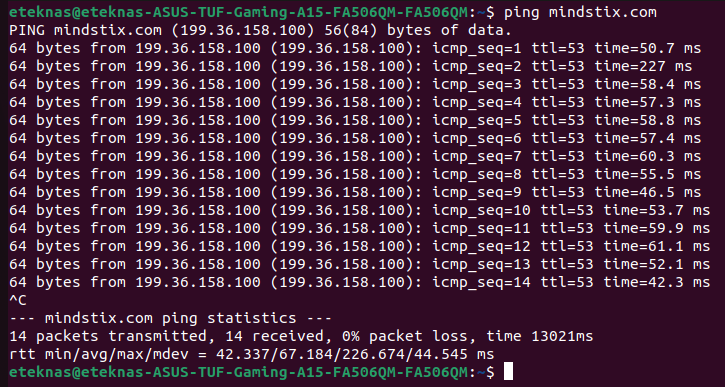
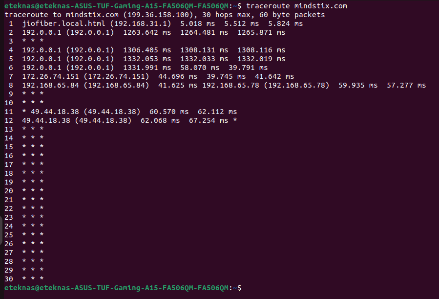
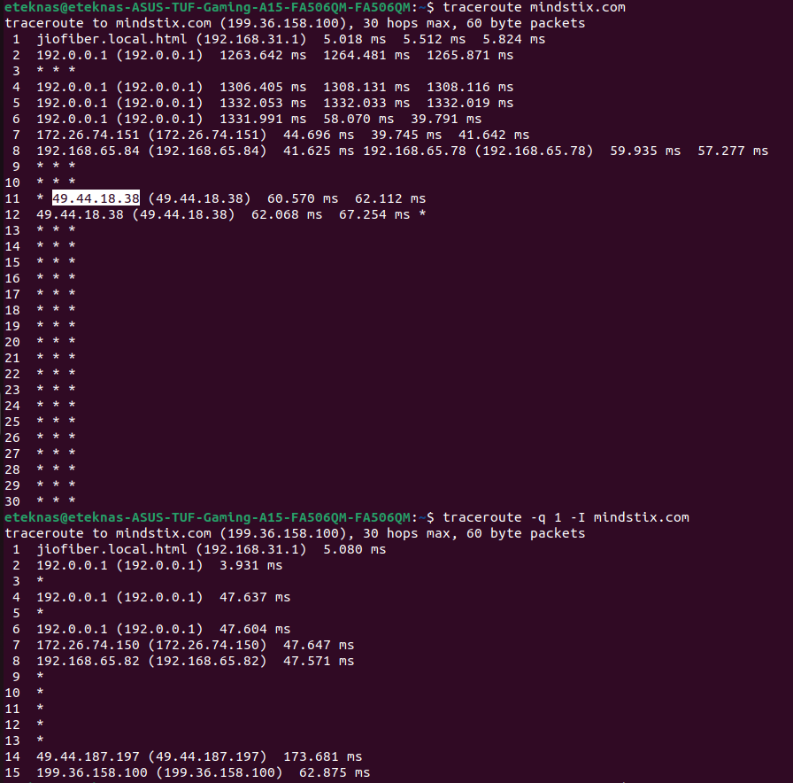
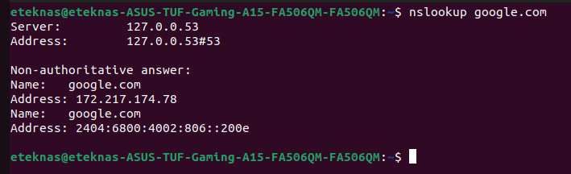
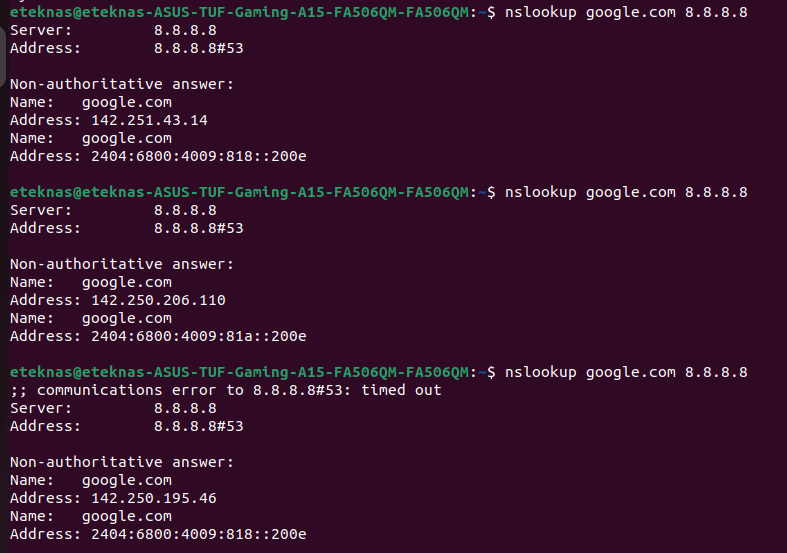
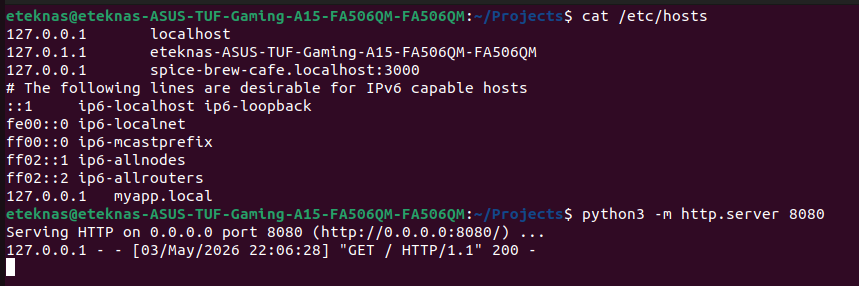
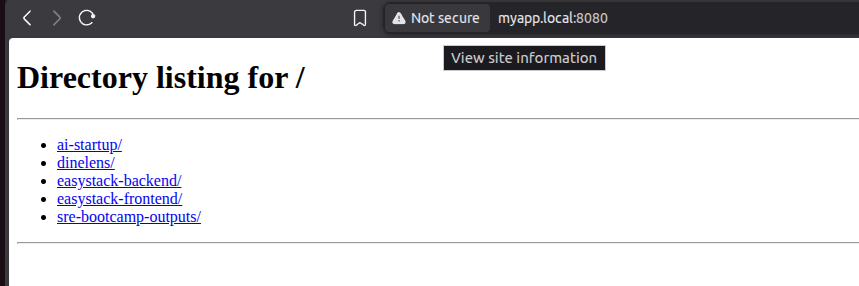

## Assignment 4B — Network Diagnostics
### Use ping to check if mindstix.com is reachable. 
Output


#### How many bytes per packet? 
64 bytes

#### What's the average round-trip time?
67.184ms

### Run traceroute mindstix.com
Output


using -I (ICMP) -q 1 (1 packet per hop)


#### How many hops does it take?
15 hops to reach the destination. But in the first scenario, the traceroute uses UDP probes, which were droped/ignored after some points, so traceroute kept trying until 30th hop

#### Where do timeouts (* * *) appear and why might that happen?
Timeout may appear when Routers are there but
- Blocking ICMP
- deprioritizing traceroute 
- Firewall blocked ICMP
- Packet dropped

Conclusion is that traceroute does not know if it has reached it destination until the router responds. 
In the first case, traceroute kept trying until the 30th hop because it didn't know if it has reached the desination as it was not receiving any response from the router after 13th hop

### Use nslookup google.com. What IP addresses does it return? Run it again — are the IPs in the same order? Why might they change?
Output


127.0.0.53 is Linux’s local DNS stub resolver, and it does sit in the middle.
 
The Non-authoritative answer:
Name:	google.com
Address: 142.250.195.46


This is the cached or forwareded IP for google.com

After using the google's DNS resolver (8.8.8.8)


The non authorative IP kept changing
Reasons:
1. Load balancing
Google distributes traffic across servers

2. Geo-based routing
Your IP (India) → nearby data centers

3. DNS caching (127.0.0.53)
Your system may:
Cache previous answers
Or refresh from upstream DNS

### Use curl -v https://httpbin.org/get. Read the output carefully and identify:
#### The request headers your client sent
```bash
> GET /get HTTP/2
> Host: httpbin.org
> user-agent: curl/7.81.0
> accept: */*
> 
```

#### The response status code
```bash
< HTTP/2 200 
```

#### The response headers the server sent
```bash
< date: Sun, 03 May 2026 16:15:06 GMT
< content-type: application/json
< content-length: 254
< server: gunicorn/19.9.0
< access-control-allow-origin: *
< access-control-allow-credentials: true
< 
```

#### The response body
```bash
{
  "args": {}, 
  "headers": {
    "Accept": "*/*", 
    "Host": "httpbin.org", 
    "User-Agent": "curl/7.81.0", 
    "X-Amzn-Trace-Id": "Root=1-69f7748a-44996201224294664222a973"
  }, 
  "origin": "49.36.44.154", 
  "url": "https://httpbin.org/get"
}
```

### Add an entry to /etc/hosts that maps myapp.local to 127.0.0.1. Then run a simple Python HTTP server (python3 -m http.server 8080) and hit it at http://myapp.local:8080 using curl. Does it work?
Added the 
127.0.0.1 myapp.local
to /etc/hosts






### Remove the /etc/hosts entry. Does it still work? Why or why not?
After removing the entry it does not work
