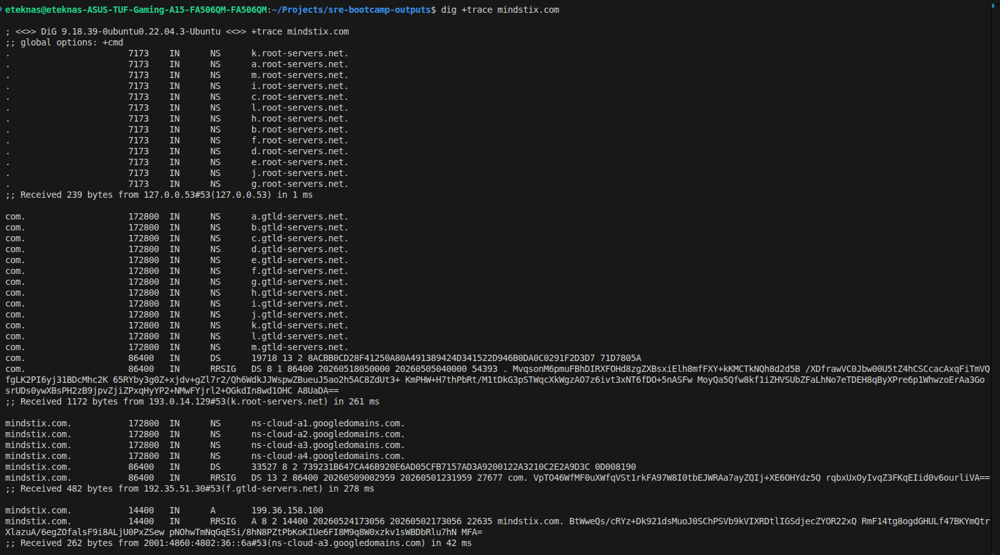

## DNS (Domain Name Server)
DNS is a system that translates human-readable domain names into IP addresses.
Example:
google.com → 142.250.x.x

### How DNS Works (Step-by-Step)
When you enter:
www.example.com

1. Browser Cache
Checks if IP already known

To check the browser cache
Brave -> brave://net-internals/#dns
Chrome -> chrome://net-internals/#dns

2. OS Cache
-> /etc/hosts (Always checked first)
-> OS DNS cache

3. Recursive Resolver (ISP / Public DNS)
Example: 8.8.8.8

Ubuntu by defualt uses the local resolver running at 127.0.0.53
and the address to the root servers are stored in the local file at /usr/share/dns/root.hints

4. Root DNS Server
There are 13 root servers globally.
Knows where .com servers are

5. TLD Server (Top Level Domain)
.com, .org, .in
Points to authoritative server

6. Authoritative DNS Server
Has actual IP of domain

7. Response Returned
example.com → 93.184.216.34

### Questions
1. Why does /etc/hosts override browser DNS cache?
Because /etc/hosts is part of the OS-level name resolution process and has higher priority than DNS caches. Browsers rely on the OS resolver, which always checks /etc/hosts before using cached or external DNS results.

2. DNS resolution demo with dig command

## DNS Record Types
| Record Type | Full Form / Meaning                   | What It Does                             | Why It Is Used                                        |
| ----------- | ------------------------------------- | ---------------------------------------- | ----------------------------------------------------- |
| **A**       | Address Record                        | Maps domain → IPv4 address               | To connect a domain to a server using IPv4            |
| **AAAA**    | Quad-A Record                         | Maps domain → IPv6 address               | Same as A record but for IPv6                         |
| **CNAME**   | Canonical Name                        | Maps one domain → another domain         | To create aliases (e.g., `www` → root domain)         |
| **MX**      | Mail Exchange                         | Specifies mail servers for a domain      | To route emails correctly                             |
| **NS**      | Name Server                           | Defines authoritative DNS servers        | To delegate DNS control to specific servers           |
| **TXT**     | Text Record                           | Stores arbitrary text data               | Used for verification (SPF, DKIM, domain ownership)   |
| **PTR**     | Pointer Record                        | Maps IP → domain (reverse DNS)           | Used for reverse lookup (important for email servers) |
| **SOA**     | Start of Authority                    | Contains DNS zone metadata               | Defines primary DNS server and zone settings          |
| **SRV**     | Service Record                        | Specifies service location (host + port) | Used by apps (e.g., VoIP, LDAP) to locate services    |
| **CAA**     | Certification Authority Authorization | Specifies allowed SSL issuers            | Controls which CA can issue SSL certificates          |
| **DS**      | Delegation Signer                     | Links child zone to parent (DNSSEC)      | Used in DNSSEC chain of trust                         |
| **RRSIG**   | Resource Record Signature             | Digital signature for DNSSEC             | Ensures authenticity of DNS data                      |
| **DNSKEY**  | DNS Key                               | Public key for DNSSEC                    | Used to verify DNSSEC signatures                      |
