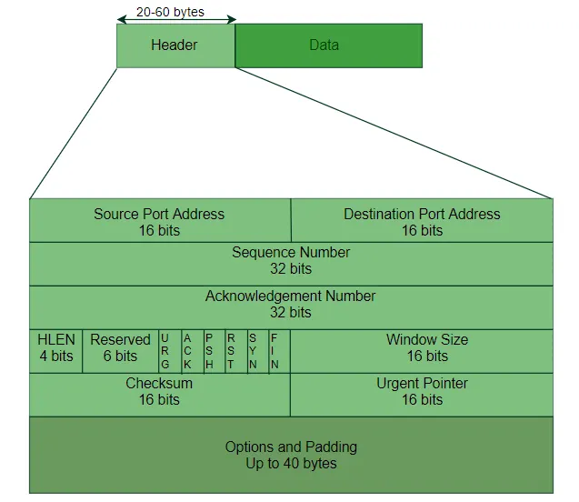

## TCP (Transmission Control Protocol)
TCP is a transport layer protocol (Layer 4 in the OSI model) that provides reliable, ordered, and error-checked delivery of data between applications running on different hosts. It is connection-oriented, meaning a connection must be established before data transfer begins.

### TCP Connection Lifecycle
Connection Establishment (TCP Three-Way Handshake)

Before data transfer, TCP establishes a connection using a three-step process:

- The client sends a SYN (synchronize) packet to the server with an initial sequence number.
- The server responds with a SYN-ACK packet, acknowledging the client’s request and sending its own sequence number.
- The client sends an ACK packet to confirm the connection.

This ensures both sides are ready to communicate and agree on initial parameters.

1. Data Transfer Phase
Once the connection is established, data transmission begins.

2. Segmentation
Data from the application layer is divided into smaller units called segments.

3. Sequence Numbers
Each byte of data is assigned a sequence number. This allows the receiver to reorder segments correctly if they arrive out of order.

4. Acknowledgements
The receiver sends acknowledgements (ACKs) indicating the next expected byte. This confirms successful receipt of data.

5. Retransmission
If the sender does not receive an acknowledgement within a certain time (timeout), it retransmits the segment.

### Connection Termination
TCP uses a four-step process to close a connection:

- One side sends a FIN (finish) signal.
- The other side acknowledges it with an ACK.
- The second side sends its own FIN.
- The first side responds with a final ACK.

This ensures both sides have completed data transmission before closing.

### Important TCP Flags
SYN: initiates a connection
ACK: acknowledges received data
FIN: terminates a connection
RST: resets a connection
PSH: pushes data to the application immediately