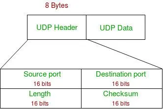

## User Datagram Protocol (UDP)
UDP is a transport layer protocol (Layer 4 in the OSI model) that provides connectionless, best-effort communication between applications. It is designed for speed and simplicity, with minimal overhead and no built-in mechanisms for reliability.

### Core Characteristics of UDP
1. Connectionless
There is no connection establishment before sending data. Each packet is sent independently.

2. Unreliable delivery
There is no guarantee that data will reach the destination.

3. No ordering
Packets may arrive out of order.

4. No retransmission
Lost packets are not resent by UDP itself.

5. Minimal overhead
Very small header, leading to faster transmission.

6. Stateless communication
No session or connection state is maintained.

### How UDP Works
UDP sends data in units called datagrams.

#### Each datagram:
Is independent of others
Contains all necessary addressing information
Is delivered on a best-effort basis

#### Flow:
Application sends data to UDP
UDP adds a small header (ports, checksum)
Data is passed to IP layer
Packet is routed to destination
Receiver delivers it to the application (if it arrives)

There is no feedback loop like acknowledgements.

### UDP Header

### Common Use Cases
UDP is preferred when speed is more important than reliability.

#### Typical applications include:
DNS (Domain Name System)
Fast queries, small packets
Video streaming
Dropped frames are acceptable
Online gaming
Real-time updates are critical
VoIP (voice calls)
Low latency required
DHCP
Broadcast-based communication
NTP (time synchronization)

## Important Concepts
### 1. Port-based Communication
Like TCP, UDP uses port numbers to identify applications.

#### Example:
DNS uses port 53
NTP uses port 123

### 2. Packet Size and Fragmentation

UDP does not manage fragmentation. If a datagram is too large:
IP layer may fragment it
Or it may be dropped

Applications often keep UDP packets small to avoid this.

### 3. Broadcast and Multicast
UDP supports:
Broadcast (one-to-all)
Multicast (one-to-many group)

This makes it useful for service discovery and streaming.

#### Limitations of UDP
1. No built-in reliability
2. No congestion control (can overwhelm network)
3. No guarantee of delivery or order
4. Not suitable for critical data transfer