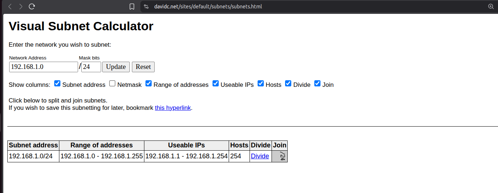
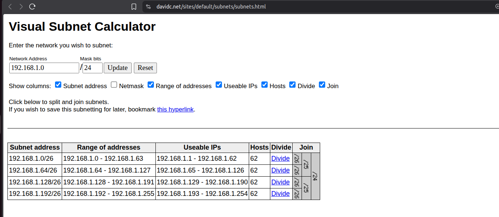

# Assignment 5A — Subnetting & Network Design Basics
### Explore the Subnet Calculator.

### Start with a network: 192.168.1.0/24

### How many total IPs are available?
Total 256 IP are available out of which 254 are Usable IPs

### How many are usable? Why are some not usable?
Usable - 254
1 IP is allocated to Network and 1 is allocated to Broadcast

### Split this network into 4 equal subnets using the tool.

### What is the new subnet mask?
255.255.255.192

### List all 4 subnets with their ranges.

Subnet address	    Netmask	            Range of addresses	            Useable IPs	Hosts	            
192.168.1.0/26	    255.255.255.192	    192.168.1.0 - 192.168.1.63	    192.168.1.1 - 192.168.1.62	    		
192.168.1.64/26	2   255.255.255.192	    192.168.1.64 - 192.168.1.127    192.168.1.65 - 192.168.1.126		
192.168.1.128/26	255.255.255.192	    192.168.1.128 - 192.168.1.191   192.168.1.129 - 192.168.1.190		
192.168.1.192/26	255.255.255.192	    192.168.1.192 - 192.168.1.255   192.168.1.193- 192.168.1.254

### Pick one of the subnets and identify:
Subnet              - 192.168.1.0/26
Network address     - 192.168.1.0
Broadcast address   - 192.168.1.63
First usable IP     - 192.168.1.1
Last usable IP      - 192.168.1.62

### Now assume:
Subnet A → 50 hosts
Subnet B → 20 hosts
Subnet C → 10 hosts
Can /26 work for all? Why or why not?

Answer -
Yes, /26 can support all subnets since it provides 62 usable IPs, which satisfies the largest requirement (50 hosts). However, it is inefficient for smaller subnets (20 and 10 hosts), leading to significant IP wastage.

For Subnet A - there are 50 hosts so out of 62, 12 IPs will be wasted
For Subnet B - 42 IPs will be wasted
For Subnet C - 52 IPs will be wasted

These subnets will work. But it is overkill for Subnet B and Subnet C. We can use  (Variable Length Subnet Mask) and have a smaller subnets for B and C such as 
/27 -> 30 Usable Hosts
/28 -> 14 Usable Hosts

### Create a subnet that supports at least 30 hosts:
### What CIDR would you choose?
For 30 hosts I will use /27, which gives me 32 IPs, out of which exactly 30 are usable

### How many IPs will be unused?
0
