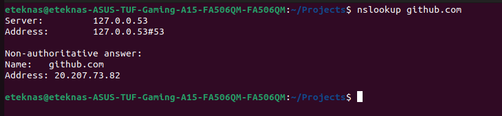
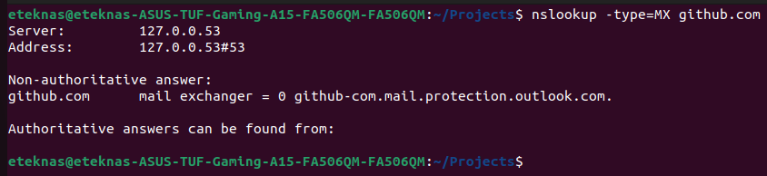
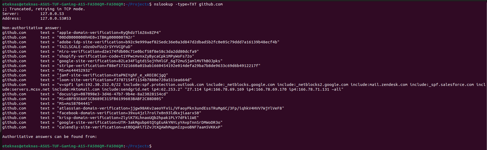
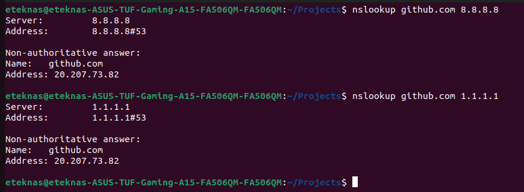
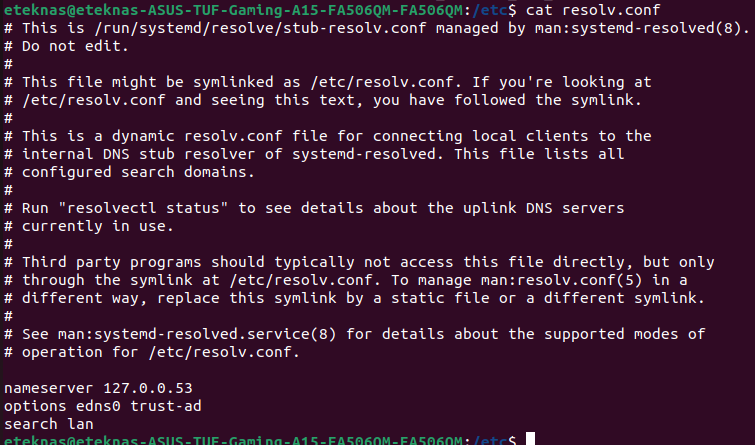

## Assignment 5B — DNS Deep Dive
### 1. Use nslookup to find the IP address of github.com. Then find its MX record. Then find its TXT records. What's in the TXT records?


Non-authoritative answer:
Name:	github.com
Address: 20.207.73.82

##### MX Records


##### TXT Records


There are Domain Verification Records
"google-site-verification=..."
"facebook-domain-verification=..."
"stripe-verification=..."
"shopify-verification-code=..."

Email Security (SPF Record)
"v=spf1 ip4:192.30.252.0/22 include:spf.protection.outlook.com ..."

Third-Party Integrations
"zendesk"
"sendgrid"
"salesforce"
"mailchimp (mcsv)"
"marketo (mktomail)"

### 2. Use nslookup but point it at a specific DNS server: nslookup github.com 8.8.8.8. Now try nslookup github.com 1.1.1.1. Do you get the same results? What are 8.8.8.8 and 1.1.1.1?


8.8.8.8 and 1.1.1.1 are the Public Recursive Resolvers provided by Google and Cloudflare.

### 3. Look at /etc/resolv.conf. What DNS server is your machine configured to use?

Your machine is configured to use 127.0.0.53 as its DNS server.
This is a local stub resolver (usually systemd-resolved) that forwards queries to upstream DNS servers.

### 4. Use curl -v https://github.com 2>&1 | head -30. Find the TLS handshake steps in the output. What certificate does GitHub present? (What is 2>&1 doing. Go and explain to your mentor proactively)
Output 
```bash
eteknas@eteknas-ASUS-TUF-Gaming-A15-FA506QM-FA506QM:/etc$ curl -v https://github.com 2>&1 | head -100
  % Total    % Received % Xferd  Average Speed   Time    Time     Time  Current
                                 Dload  Upload   Total   Spent    Left  Speed
  0     0    0     0    0     0      0      0 --:--:-- --:--:-- --:--:--     0*   Trying 20.207.73.82:443...
* Connected to github.com (20.207.73.82) port 443 (#0)
* ALPN, offering h2
* ALPN, offering http/1.1
*  CAfile: /etc/ssl/certs/ca-certificates.crt
*  CApath: /etc/ssl/certs
* TLSv1.0 (OUT), TLS header, Certificate Status (22):
} [5 bytes data]
* TLSv1.3 (OUT), TLS handshake, Client hello (1):
} [512 bytes data]
* TLSv1.2 (IN), TLS header, Certificate Status (22):
{ [5 bytes data]
* TLSv1.3 (IN), TLS handshake, Server hello (2):
{ [122 bytes data]
* TLSv1.2 (IN), TLS header, Finished (20):
{ [5 bytes data]
* TLSv1.2 (IN), TLS header, Supplemental data (23):
{ [5 bytes data]
* TLSv1.3 (IN), TLS handshake, Encrypted Extensions (8):
{ [19 bytes data]
* TLSv1.2 (IN), TLS header, Supplemental data (23):
{ [5 bytes data]
* TLSv1.3 (IN), TLS handshake, Certificate (11):
{ [2741 bytes data]
* TLSv1.2 (IN), TLS header, Supplemental data (23):
{ [5 bytes data]
* TLSv1.3 (IN), TLS handshake, CERT verify (15):
{ [79 bytes data]
* TLSv1.2 (IN), TLS header, Supplemental data (23):
{ [5 bytes data]
* TLSv1.3 (IN), TLS handshake, Finished (20):
{ [36 bytes data]
* TLSv1.2 (OUT), TLS header, Finished (20):
} [5 bytes data]
* TLSv1.3 (OUT), TLS change cipher, Change cipher spec (1):
} [1 bytes data]
* TLSv1.2 (OUT), TLS header, Supplemental data (23):
} [5 bytes data]
* TLSv1.3 (OUT), TLS handshake, Finished (20):
} [36 bytes data]
* SSL connection using TLSv1.3 / TLS_AES_128_GCM_SHA256
* ALPN, server accepted to use h2
* Server certificate:
*  subject: CN=*.github.com
*  start date: May  4 00:00:00 2026 GMT
*  expire date: Aug  1 23:59:59 2026 GMT
*  subjectAltName: host "github.com" matched cert's "github.com"
*  issuer: C=GB; O=Sectigo Limited; CN=Sectigo Public Server Authentication CA DV E36
*  SSL certificate verify ok.
* Using HTTP2, server supports multiplexing
* Connection state changed (HTTP/2 confirmed)
* Copying HTTP/2 data in stream buffer to connection buffer after upgrade: len=0
* TLSv1.2 (OUT), TLS header, Supplemental data (23):
} [5 bytes data]
* TLSv1.2 (OUT), TLS header, Supplemental data (23):
} [5 bytes data]
* TLSv1.2 (OUT), TLS header, Supplemental data (23):
} [5 bytes data]
* Using Stream ID: 1 (easy handle 0x59bd6fb609f0)
* TLSv1.2 (OUT), TLS header, Supplemental data (23):
} [5 bytes data]
> GET / HTTP/2
> Host: github.com
> user-agent: curl/7.81.0
> accept: */*
> 
* TLSv1.2 (IN), TLS header, Supplemental data (23):
{ [5 bytes data]
* TLSv1.3 (IN), TLS handshake, Newsession Ticket (4):
{ [57 bytes data]
* TLSv1.2 (IN), TLS header, Supplemental data (23):
{ [5 bytes data]
* TLSv1.3 (IN), TLS handshake, Newsession Ticket (4):
{ [57 bytes data]
* old SSL session ID is stale, removing
* TLSv1.2 (IN), TLS header, Supplemental data (23):
{ [5 bytes data]
* TLSv1.2 (OUT), TLS header, Supplemental data (23):
} [5 bytes data]
  0     0    0     0    0     0      0      0 --:--:-- --:--:-- --:--:--     0* TLSv1.2 (IN), TLS header, Supplemental data (23):
{ [5 bytes data]
* TLSv1.2 (IN), TLS header, Supplemental data (23):
{ [5 bytes data]
* TLSv1.2 (IN), TLS header, Supplemental data (23):
{ [5 bytes data]
* TLSv1.2 (IN), TLS header, Supplemental data (23):
{ [5 bytes data]
```

github.com has presented Sectigo Public Server Authentication CA DV E36 Certificate Issued by Sectigo Limited


#### File Descriptors
Here 2>&1 is used to direct sterr to stdout which is then used by pipe operations
Bydefault only 

In Unix-like systems, every process starts with three standard streams:
| FD | Name   | Purpose          | Default  |
| -- | ------ | ---------------- | -------- |
| 0  | stdin  | Input to program | Keyboard |
| 1  | stdout | Normal output    | Terminal |
| 2  | stderr | Error output     | Terminal |

Basic Syntax
| Syntax            | Meaning              |
| ----------------- | -------------------- |
| `>`               | stdout to file       |
| `2>`              | stderr to file       |
| `>>`              | append stdout        |
| `2>>`             | append stderr        |
| `2>&1`            | stderr → stdout      |
| `&>`              | both stdout + stderr |
| `>/dev/null`      | discard stdout       |
| `2>/dev/null`     | discard stderr       |
| `>/dev/null 2>&1` | discard everything   |
