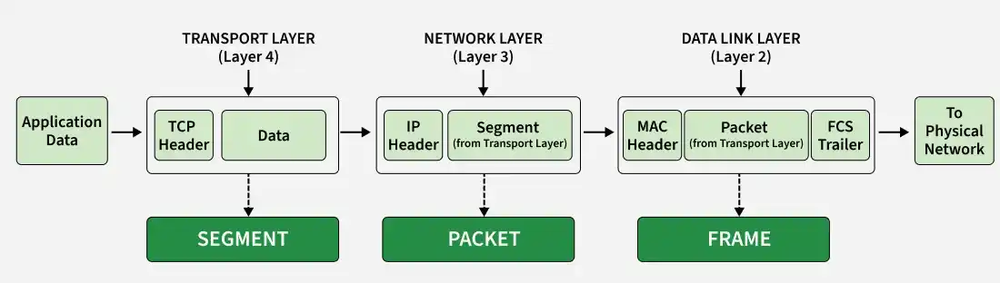

## OSI Model
A 7-layer conceptual framework that standardizes how data is transmitted across a network.

### The 7 Layers (Top to Bottom)
| Layer | Name         | Key Responsibility           | Examples          |
| ----- | ------------ | ---------------------------- | ----------------- |
| 7     | Application  | User-facing network services | HTTP, DNS, FTP    |
| 6     | Presentation | Data format, encryption      | SSL/TLS, encoding |
| 5     | Session      | Session management           | Session APIs      |
| 4     | Transport    | End-to-end delivery          | TCP, UDP          |
| 3     | Network      | Routing, IP addressing       | IP, ICMP          |
| 2     | Data Link    | MAC addressing, framing      | Ethernet, ARP     |
| 1     | Physical     | Transmission of bits         | Cables, signals   |

### Layer 7 — Application Layer
Closest to the user; provides network services to applications

#### Responsibilities:
1. Web browsing
2. Email sending
3. File transfers

#### Protocols:
1. HTTP / HTTPS
2. DNS
3. FTP
4. SMTP

When you open a website HTTP request is created

### Layer 6 — Presentation Layer
Handles data formatting, encryption, compression

#### Responsibilities:
Encryption / Decryption
Data encoding (JSON, XML)
Compression

#### Technologies:
SSL/TLS
Base64

HTTPS encrypts data here. 
This is where TLS Handshake is done

#### TLS Handshake (Where Certificates Are Used)
Step-by-step TLS flow

Client Hello
Supported TLS versions
Supported cipher suites
Server Hello
Selected cipher suite
Server sends certificate
Contains public key
Issued by CA
Client verifies certificate
Checks trust chain
Key exchange
Symmetric session key is created
Secure communication begins

### Layer 5 — Session Layer
Manages sessions between applications

#### Responsibilities:
Session creation
Session maintenance
Session termination

Login session in a web app

### Layer 4 — Transport Layer
Ensures end-to-end communication between applications

#### Responsibilities:
Segmentation
Reliability
Flow control
Port addressing

#### Protocols:
TCP (reliable)

UDP (fast)s

HTTP/HTTPS uses TCP port 80/443

### Layer 3 — Network Layer
Handles routing of packets between networks

#### Responsibilities:
IP addressing
Routing decisions

#### Protocols:
IP
ICMP

Your packet travels across the internet using IP

### Layer 2 — Data Link Layer
Handles communication within the same network

#### Responsibilities:
MAC addressing
Frame creation
Error detection

#### Protocols:
Ethernet
ARP (Address Resolution Protocol)

Router finds MAC address using ARP

### Layer 1 — Physical Layer
Transmits raw bits over physical medium

#### Responsibilities:
Electrical signals
Cables
Hardware transmission

WiFi signals or Ethernet cables

## Mapping to TCP/IP
| TCP/IP Layer   | OSI Equivalent |
| -------------- | -------------- |
| Application    | L7, L6, L5     |
| Transport      | L4             |
| Internet       | L3             |
| Network Access | L2, L1         |
