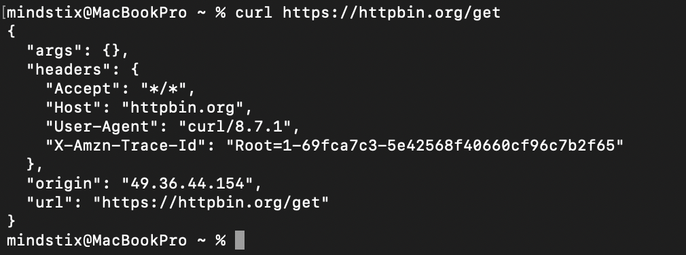
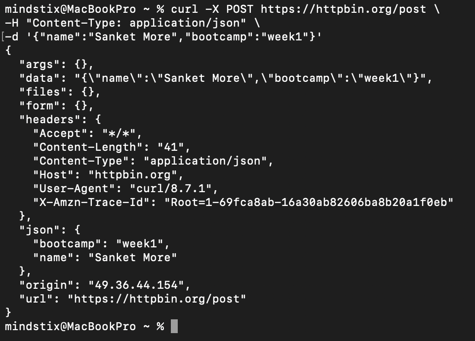
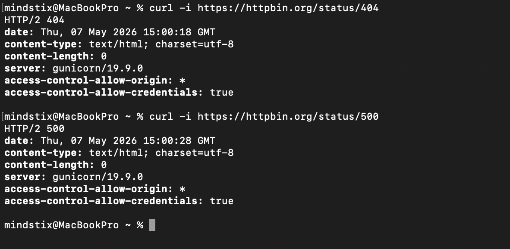
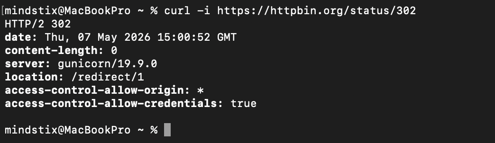
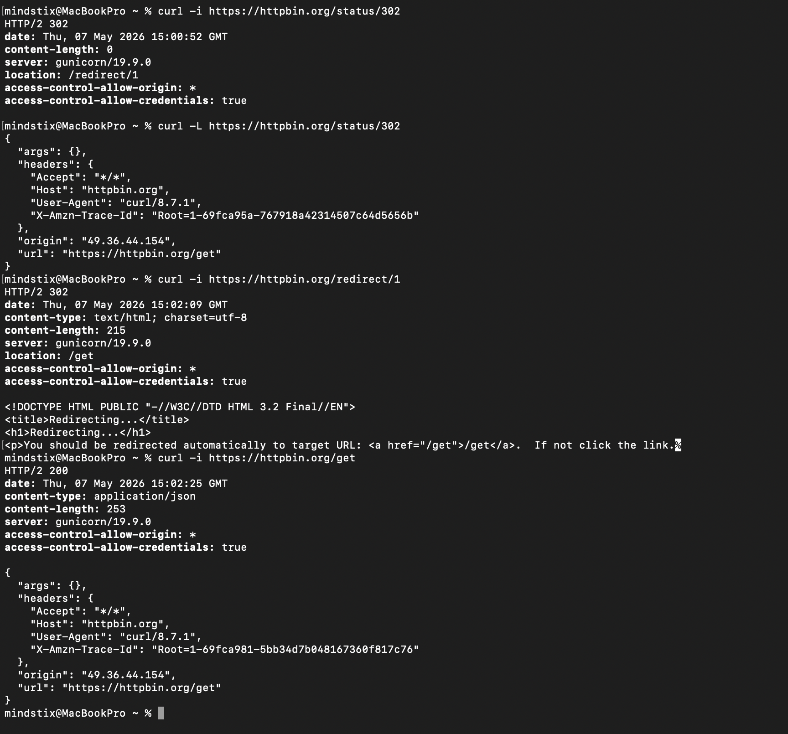
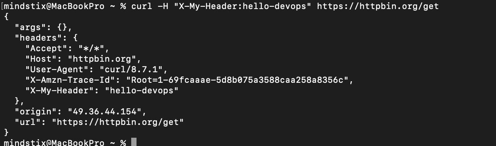
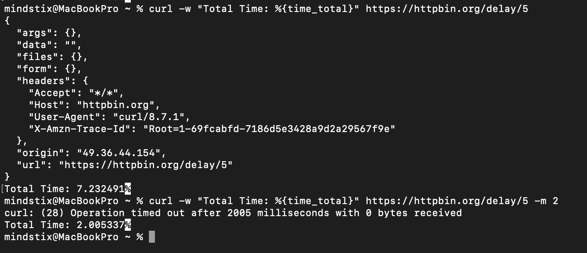

### 1. Make a GET request to https://httpbin.org/get. Read the response. What does it show you?


- args - Query Parameter
- headers - request headers curl sent
- origin - my IP Address
- url - endpoint requested


### 2. Make a POST request to https://httpbin.org/post with a JSON body {"name": "your-name", "bootcamp": "week1"}. Set the correct Content-Type header. Do it with curl AND Postman.
Curl
```bash
curl -X POST https://httpbin.org/post \
-H "Content-Type: application/json" \
-d '{"name":"Sanket More","bootcamp":"week1"}'
```




### 3. Make a request to https://httpbin.org/status/404. What happens? Now try /status/500. Try /status/302 — what does curl do by default? What flag makes curl follow the redirect?


/status/302
It returns the redirect URL in the Response but does not directly redirect to the URL



To make the curl follow the redirect we need to use the -L flag



### 4. Make a request to https://httpbin.org/headers and add a custom header X-My-Header: hello-devops. Verify it appears in the response.


### 5. Make a request to https://httpbin.org/delay/5. This simulates a slow server. What's the response time? How would you set a timeout in curl so it fails fast?


We can use -w flag to format the output based on some variable
| Variable  	        | Description                                                       |
| --------------------- | ----------------------------------------------------------------- |
| %{time_namelookup}    | Time from the start until the name resolving (DNS) was completed. |
| %{time_connect}	    | Time until the TCP connect to the remote host was completed.      |
| %{time_appconnect}	| Time until the SSL/SSH/etc connect/handshake was completed.       |
| %{time_pretransfer}	| Time until the file transfer was just about to begin.             |
| %{time_starttransfer}	| Time until the first byte was about to be transferred (Time to First Byte). |
| %{time_total}	        | Total time in seconds that the full operation lasted.             | 


We can set the -m flag for total timeout