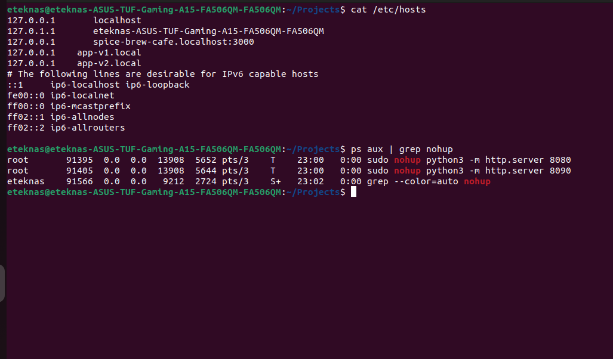
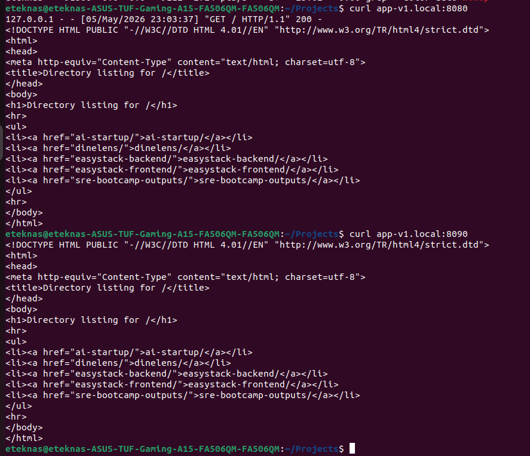
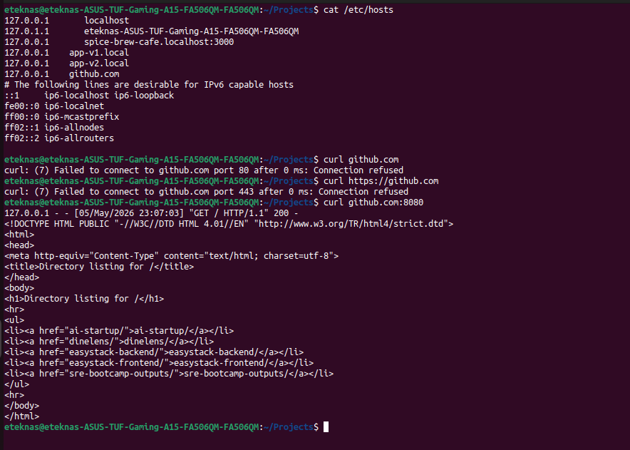

## Assignment 6B — /etc/hosts Manipulation
### You're going to simulate what it's like to test a new version of a service before DNS is updated.
### Start the Python HTTP server on port 8080 (from Day 4): python3 -m http.server 8080
### Start a second one on port 9090 in a different directory
### Add two entries to /etc/hosts:
### 127.0.0.1    app-v1.local
### 127.0.0.1    app-v2.local
### Use curl to hit app-v1.local:8080 and app-v2.local:9090. Do they work?

### what happens if you add an entry for a real domain like github.com pointing to 127.0.0.1? Try it (in a safe way — open a new terminal and curl it, don't use your browser for important things). What error do you get and why?

When we curl to github.com, it by defualt uses http which uses port 80 to connect to machine. Now there is nothing running on the port 80 and hence we are getting the error: connection refused

But if we try to curl github.com:8080 if we connect to our server running on the port 8080
